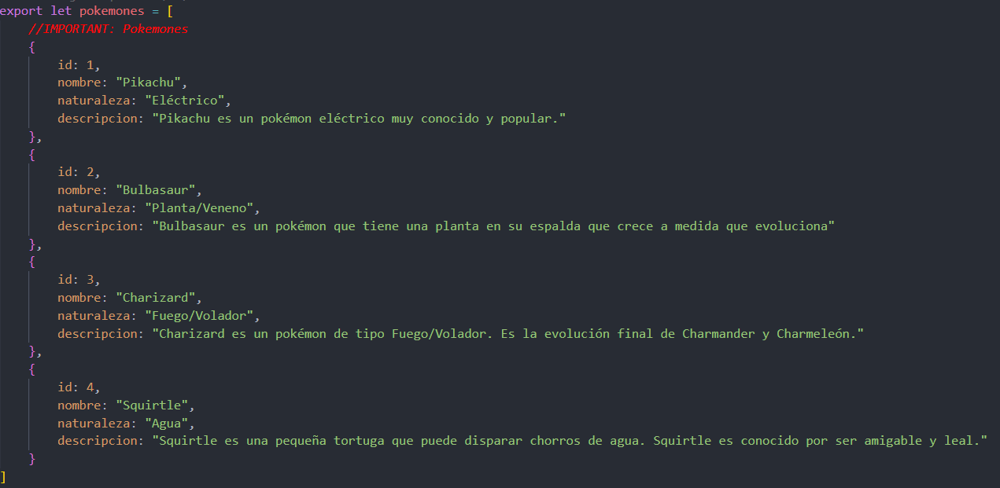

## Better Comments 

La extensión "Better Comments" es una herramienta para mejorar la legibilidad y organización de tus comentarios en el código fuente en Visual Studio Code. Permite categorizar los comentarios mediante la adición de etiquetas especiales que resaltan de manera diferente en el editor, facilitando la identificación de comentarios importantes, tareas pendientes, notas, etc.

Aquí tienes un resumen de algunas etiquetas predefinidas que puedes usar con "Better Comments":

- **`TODO`**: Resalta tareas pendientes.
- **`FIXME`**: Resalta problemas que necesitan ser corregidos.
- **`NOTE`**: Destaca comentarios importantes o informativos.
- **`HACK`**: Indica soluciones temporales o códigos dudosos.
- **`DEBUG`**: Marca secciones de código relacionadas con la depuración.

Para instalar la extensión "Better Comments" en Visual Studio Code, sigue estos pasos:

1. Abre Visual Studio Code.
2. Ve a la barra lateral izquierda y selecciona el ícono de "Extensiones" (o puedes usar el atajo **`Ctrl+Shift+X`** en Windows/Linux o **`Cmd+Shift+X`** en macOS).
3. En el cuadro de búsqueda, escribe "Better Comments".
4. Deberías ver la extensión "Better Comments" en los resultados de la búsqueda.
5. Haz clic en la extensión "Better Comments" en los resultados de la búsqueda.
6. Aparecerá un botón de "Instalar". Haz clic en ese botón.
7. Después de la instalación, aparecerá un botón de "Recargar" para reiniciar Visual Studio Code y activar la extensión. Haz clic en "Recargar".
8. La extensión ahora debería estar activa. Puedes comenzar a usar las etiquetas especiales en tus comentarios para aprovechar las funciones de resaltado.

Ejemplo de como usar las etiquetas predefinidas de la extensión "Better Comments":

