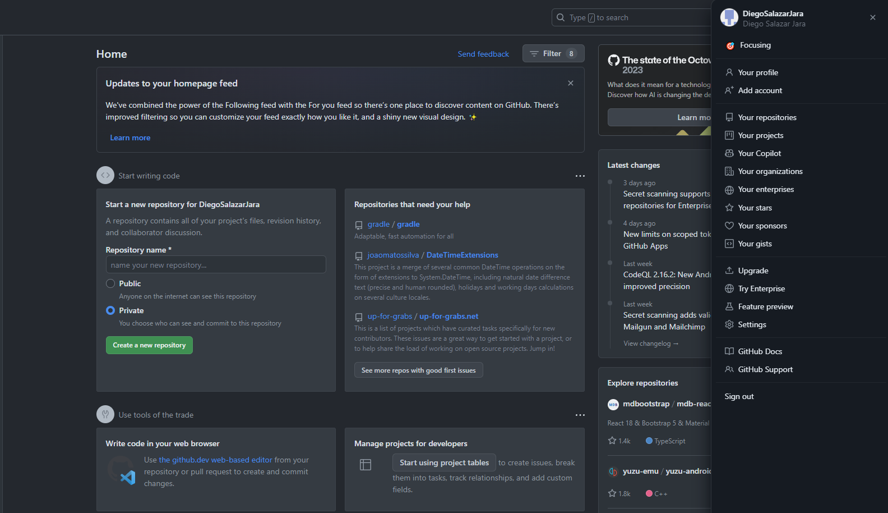
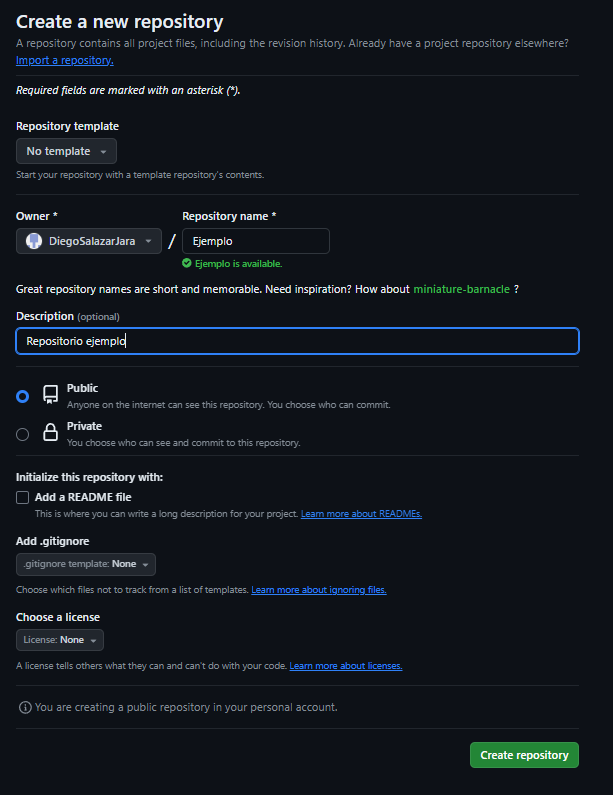
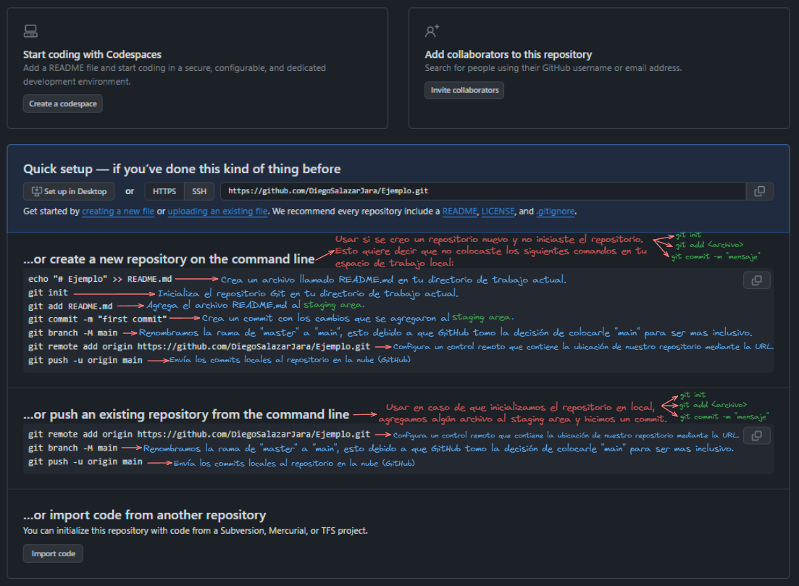

## Mi primer repositorio en Github 👾

Una vez creada y iniciada nuestra cuenta en GitHub, los pasos son los siguientes:

1. Clickeamos nuestro icono de perfil

2. Nos vamos al apartado de `Your repositories`.
3. Hay una opción en verde que dice `New`, esto nos sirve para crear un nuevo repositorio.

4. Lo clickeamos y procedemos a configurar nuestro repositorio.

5. Una vez creado el repositorio, tendremos lo siguiente:

6. Seleccionar los comandos que necesitemos, esto quiere decir que:

    - En caso de haber colocado los comandos `git init`, `git add <archivo>` y `git commit -m "mensaje"`, nosotros debemos copiar los 3 comandos que se mencionan en el área `...or push an existing repository for the command line`.
    - En caso de no haber colocado los comandos `git init`, `git add <archivo>` y `git commit -m "mensaje"`, nosotros debemos copiar los 7 comandos que se mencionan en el área `...or create a new repository on the command line`.

## Tips 💡

Recuerden que es buena práctica dejar un Markdown al inicio de su repositorio, esto para especificar de que se trata, que contiene y quieres son los autores.

Les dejo la documentación oficial de GitHub sobre los Markdown y como modificarlos a su gusto: [Click aquí!](https://docs.github.com/es/get-started/writing-on-github/getting-started-with-writing-and-formatting-on-github/quickstart-for-writing-on-github)