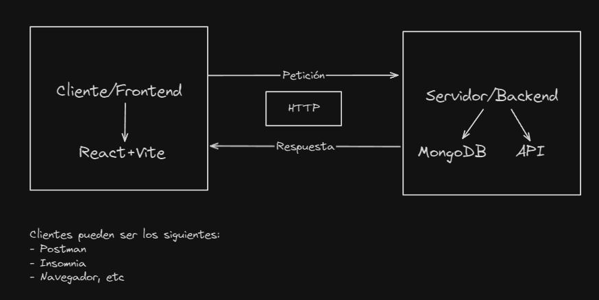

## Arquitectura Cliente/Servidor

La arquitectura cliente/servidor es un modelo en el que un cliente y un servidor interactúan entre sí para realizar tareas y procesar información. En este modelo, el enfoque principal se encuentra en el cliente, que es el punto de acceso para los usuarios finales.

El cliente es la interfaz a través de la cual los usuarios interactúan con el servidor. Puede ser una aplicación de escritorio, una aplicación móvil o un navegador web. El cliente se encarga de enviar solicitudes al servidor y recibir respuestas.

Una de las ventajas de esta arquitectura es que el cliente puede ser ligero y fácil de usar, ya que la mayor parte del procesamiento y almacenamiento de datos se realiza en el servidor. Esto permite que el cliente funcione en dispositivos con recursos limitados, como teléfonos móviles o computadoras de baja potencia.

El cliente también puede ofrecer una interfaz de usuario intuitiva y atractiva. Puede proporcionar funcionalidades como la validación de datos, la presentación de resultados y la gestión de la interfaz de usuario. Además, el cliente puede almacenar en caché datos para mejorar el rendimiento y permitir el acceso a funciones sin conexión.

En resumen, la arquitectura cliente/servidor se centra en el cliente como punto de acceso para los usuarios finales. El cliente interactúa con el servidor para realizar tareas y procesar información, ofreciendo una interfaz intuitiva y funcionalidades adicionales para mejorar la experiencia del usuario.

