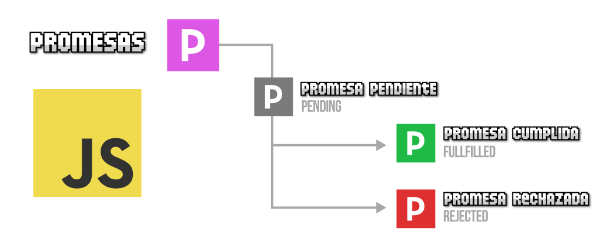

## Promesas

Como su propio nombre indica, una `promesa` es algo que, en principio pensamos que se cumplirá, pero en el futuro pueden ocurrir varias cosas:



### Ejemplo

```js
// Creación de una nueva promesa
const miPromesa = new Promise((resolve, reject) => {
    // Simulación de una tarea asincrónica (en este caso, un retardo de 2 segundos)
    setTimeout(() => {
        const exito = false;
        if (exito) {
            // Si la tarea asincrónica fue exitosa, se resuelve la promesa
            resolve("La tarea se completó exitosamente");
        } else {
            // Si la tarea asincrónica falló, se rechaza la promesa
            reject("Hubo un error en la tarea");
        }
    }, 2000);
});

// Usamos then y catch para manejar el resultado de la promesa
miPromesa
    .then((mensaje) => {
        console.log(mensaje); // Imprime "La tarea se completó exitosamente"
    })
    .catch((error) => {
        console.error(error); // Imprime "Hubo un error en la tarea"
    });
```