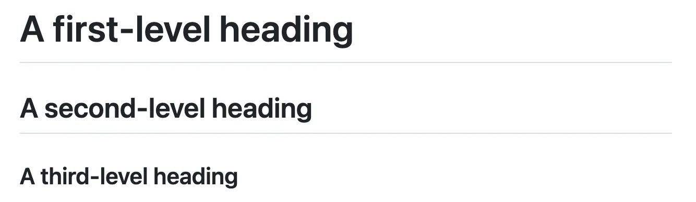
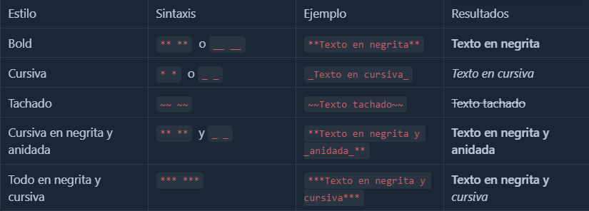
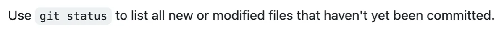
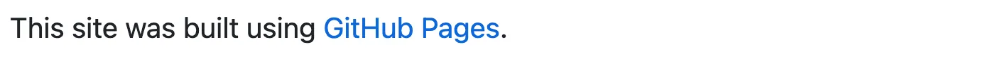
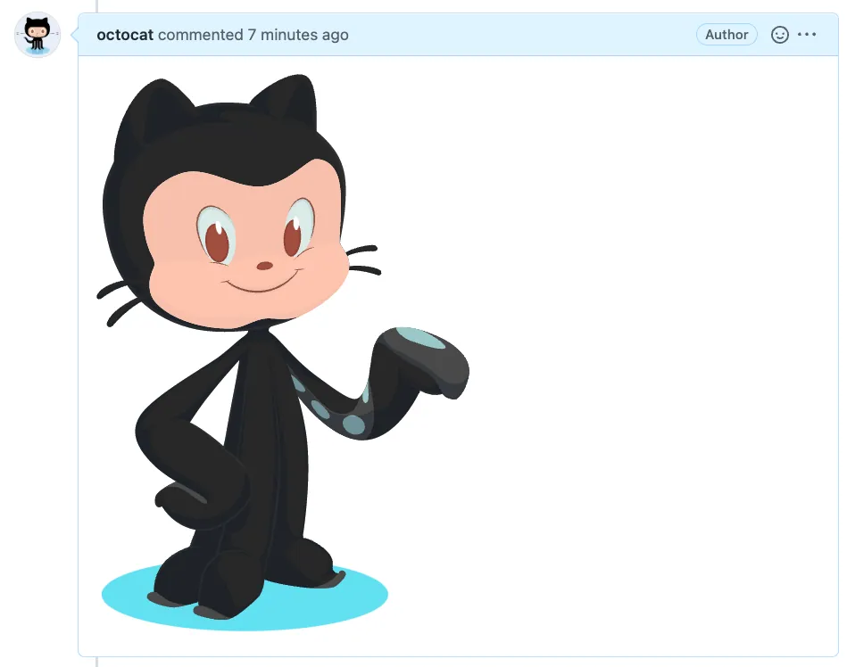
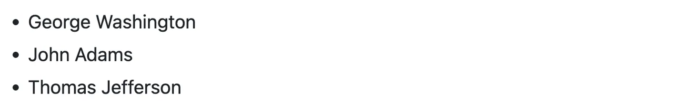
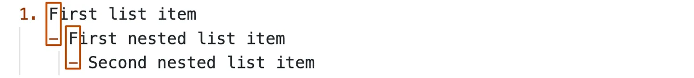
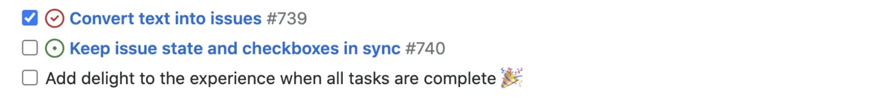
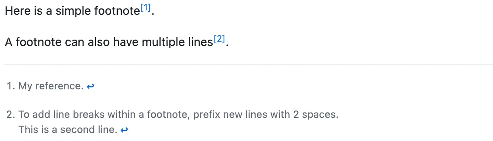
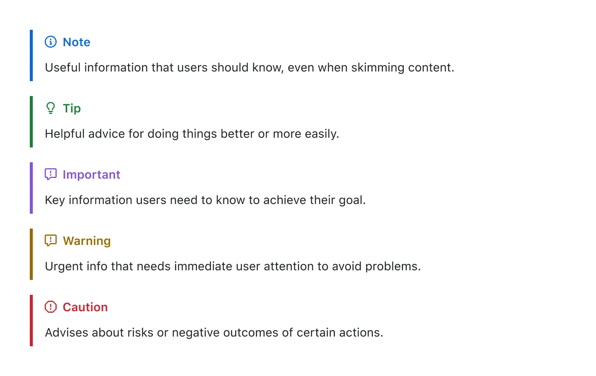

## Sintaxis de escritura y formatos básicos

### Encabezados

Los encabezados se definen con el símbolo `#` seguido de un espacio y el texto del encabezado. El número de `#` indica el nivel del encabezado. Por ejemplo:

```markdown
# A first-level heading
## A second-level heading
### A third-level heading
```



### Estilos de texto

GitHub te permite colocar un énfasis con texto en negrita, cursiva, tachado, o de suíndice en los archivos .md .



### Entrecomillado de texto

Puede entrecomillar texto con > .

```markdown
Text that is not a quote

> Text that is a quote
```


### Código de cita

Puede citar texto con un solo acento grave ` o tres acentos graves ``` .

```markdown
Use `git status` to list all new or modified files that haven't yet been committed.
```



Para formatear código o texto en su propio bloque distintivo, usa comillas triples.

```markdown
Some basic Git commands are:

git status
git add
git commit
```


### Vínculos

Puede crear un enlace a una URL o a una ubicación de archivo con el siguiente formato:

```markdown
This site was built using [GitHub Pages](https://pages.github.com/).
```



### Vínculos relativos

Puedes definir enlaces relativos y rutas de imagen en los archivos representados para ayudar a que los lectores naveguen hasta otros archivos de tu repositorio.

```markdown
[Contribution guidelines for this project](docs/CONTRIBUTING.md)
```

### Imágenes

Puede mostrar una imagen agregando ! y ajustar el texto alternativo en [ ]. El texto alternativo es un texto corto equivalente a la información de la imagen. Luego, escribe el vínculo de la imagen entre paréntesis ().

```markdown

```



### Listas

Puedes crear una lista sin ordenar. Para ello, coloca - , *  o +  antes de una o más líneas de texto.

```markdown
- George Washington
* John Adams
+ Thomas Jefferson
```



Para ordenar tu lista, antecede cada línea con un número.

```markdown
1. James Madison
2. James Monroe
3. John Quincy Adams
```


### Listas anidadas

Puedes crear una lista anidada al dejar sangría en uno o más elementos de la lista debajo de otro elemento.

```markdown
1. First list item
   - First nested list item
     - Second nested list item
```




### Listas de tareas

Para crear una lista de tareas, debe añadir como prefijo un guion y espacio, seguido de [ ] a los elementos de la lista. Para marcar una tarea como completada, use [x].

```markdown
- [x] #739
- [ ] https://github.com/octo-org/octo-repo/issues/740
- [ ] Add delight to the experience when all tasks are complete :tada:
```



### Usar emojis

Puedes agregar emoji a la escritura escribiendo :EMOJICODE:, dos puntos seguidos del nombre del emoji.

```markdown
@octocat :+1: This PR looks great - it's ready to merge! :shipit:
```


Puedes encontrar una [hoja de referencia rápida de los emoji](https://github.com/ikatyang/emoji-cheat-sheet/blob/master/README.md) acá o también puedes ir a una [página super buena que si clickear un emoji ya esta copiado!](https://emojikeyboard.top/es/)

### Notas al pie

Puedes agregar notas al pie para tu contenido si utilizas esta sintaxis de corchetes:

```markdown
Here is a simple footnote[^1].

A footnote can also have multiple lines[^2].

[^1]: My reference.
[^2]: To add line breaks within a footnote, prefix new lines with 2 spaces.
  This is a second line.
```



### Alertas

Las alertas son una extensión Markdown basada en la sintaxis blockquote que puede utilizar para resaltar la información crítica. En GitHub, se muestran con colores e iconos distintivos para indicar la importancia del contenido.

```markdown
> [!NOTE]
> Useful information that users should know, even when skimming content.

> [!TIP]
> Helpful advice for doing things better or more easily.

> [!IMPORTANT]
> Key information users need to know to achieve their goal.

> [!WARNING]
> Urgent info that needs immediate user attention to avoid problems.

> [!CAUTION]
> Advises about risks or negative outcomes of certain actions.
```

