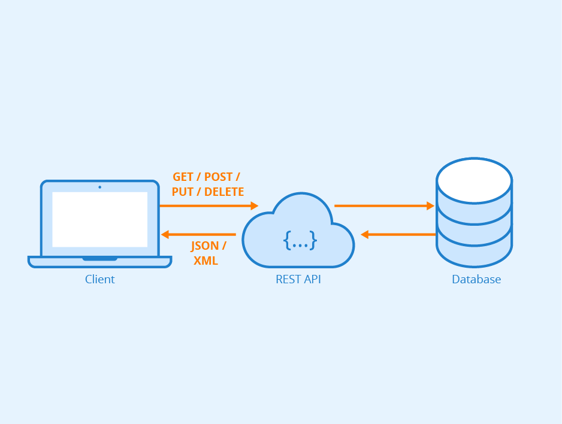

## ¿Qué es una API?

Las API son mecanismos que permiten a dos componentes de software comunicarse entre sí mediante un conjunto de definiciones y protocolos. Por ejemplo, el sistema de software del instituto de meteorología contiene datos meteorológicos diarios. La aplicación meteorológica de su teléfono “habla” con este sistema a través de las API y le muestra las actualizaciones meteorológicas diarias en su teléfono.

## ¿Qué significa API?

API significa “interfaz de programación de aplicaciones”. En el contexto de las API, la palabra aplicación se refiere a cualquier software con una función distinta. La interfaz puede considerarse como un contrato de servicio entre dos aplicaciones. Este contrato define cómo se comunican entre sí mediante solicitudes y respuestas. La documentación de su API contiene información sobre cómo los desarrolladores deben estructurar esas solicitudes y respuestas.

## ¿Cómo funciona las API?

La arquitectura de las API suele explicarse en términos de cliente y servidor. La aplicación que envía la solicitud se llama cliente, y la que envía la respuesta se llama servidor. En el ejemplo del tiempo, la base de datos meteorológicos del instituto es el servidor y la aplicación móvil es el cliente.

## Diferentes tipos de funcionamiento de una API

1. **API de SOAP**: Estas API utilizan el protocolo simple de acceso a objetos. El cliente y el servidor intercambian mensajes mediante XML. Se trata de una API menos flexible que era más popular en el pasado.

2. **API de RPC**: Estas API se denominan llamadas a procedimientos remotos. El cliente completa una función (o procedimiento) en el servidor, y el servidor devuelve el resultado al cliente.

3. **API de WebSocket:** La [API de WebSocket](https://docs.aws.amazon.com/apigateway/latest/developerguide/apigateway-websocket-api-overview?pg=wianapi&cta=websocketapi) es otro desarrollo moderno de la API web que utiliza objetos JSON para transmitir datos. La API de WebSocket admite la comunicación bidireccional entre las aplicaciones cliente y el servidor. El servidor puede enviar mensajes de devolución de llamada a los clientes conectados, por lo que es más eficiente que la API de REST.

4. **API de REST**: Estas son las API más populares y flexibles que se encuentran en la web actualmente. El cliente envía las solicitudes al servidor como datos. El servidor utiliza esta entrada del cliente para iniciar funciones internas y devuelve los datos de salida al cliente. Veamos las API de REST con más detalle a continuación.

## ¿Qué son las API de REST?

REST significa transferencia de estado representacional. REST define un conjunto de funciones como GET, PUT, DELETE, etc. que los clientes pueden utilizar para acceder a los datos del servidor. Los clientes y los servidores intercambian datos mediante HTTP.

La principal característica de la [API de REST](https://docs.aws.amazon.com/apigateway/latest/developerguide/http-api-vs-rest?pg=wianapi&cta=restapi) es que no tiene estado. La ausencia de estado significa que los servidores no guardan los datos del cliente entre las solicitudes. Las solicitudes de los clientes al servidor son similares a las URL que se escriben en el navegador para visitar un sitio web. La respuesta del servidor son datos simples, sin la típica representación gráfica de una página web.

## ¿Qué beneficios ofrecen las API de REST?

Las API de REST ofrecen cuatro beneficios principales:

#### 1. Integración

Las API se utilizan para integrar nuevas aplicaciones con los sistemas de software existentes. Esto aumenta la velocidad de desarrollo, ya que no hay que escribir cada funcionalidad desde cero. Puede utilizar las API para aprovechar el código existente.

#### 2. Innovación

Sectores enteros pueden cambiar con la llegada de una nueva aplicación. Las empresas deben responder con rapidez y respaldar la rápida implementación de servicios innovadores. Para ello, pueden hacer cambios en la API sin tener que reescribir todo el código.

#### 3. Ampliación

Las API presentan una oportunidad única para que las empresas satisfagan las necesidades de sus clientes en diferentes plataformas. Por ejemplo, la API de mapas permite la integración de información de los mapas en sitios web, Android, iOS, etc. Cualquier empresa puede dar un acceso similar a sus bases de datos internas mediante el uso de API gratuitas o de pago.

#### 4. Facilidad de mantenimiento

La API actúa como una puerta de enlace entre dos sistemas. Cada sistema está obligado a hacer cambios internos para que la API no se vea afectada. De este modo, cualquier cambio futuro que haga una de las partes en el código no afectará a la otra.

## ¿Cómo proteger una API de REST?

Todas las API deben protegerse mediante una autenticación y una supervisión adecuadas. Las dos maneras principales de proteger las API de REST son las siguientes:

#### 1. Tokens de autenticación

Se utilizan para autorizar a los usuarios a hacer la llamada a la API. Los tokens de autenticación comprueban que los usuarios son quienes dicen ser y que tienen los derechos de acceso para esa llamada concreta a la API. Por ejemplo, cuando inicia sesión en el servidor de correo electrónico, el cliente de correo electrónico utiliza tokens de autenticación para un acceso seguro.

#### 2. Claves de API

Las claves de API verifican el programa o la aplicación que hace la llamada a la API. Identifican la aplicación y se aseguran de que tiene los derechos de acceso necesarios para hacer la llamada a la API en cuestión. Las claves de API no son tan seguras como los tokens, pero permiten supervisar la API para recopilar datos sobre su uso. Es posible que haya notado una larga cadena de caracteres y números en la URL de su navegador cuando visita diferentes sitios web. Esta cadena es una clave de la API que el sitio web utiliza para hacer llamadas internas a la API.