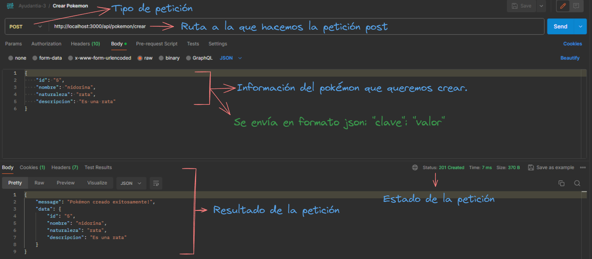
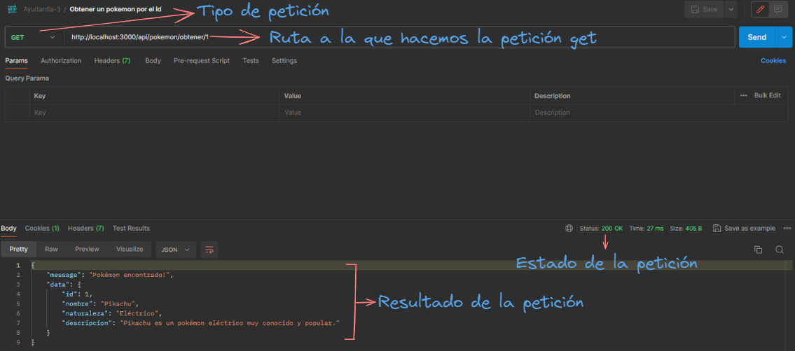
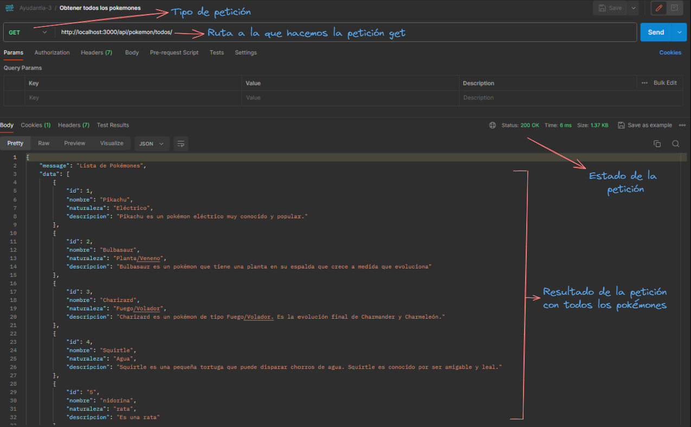
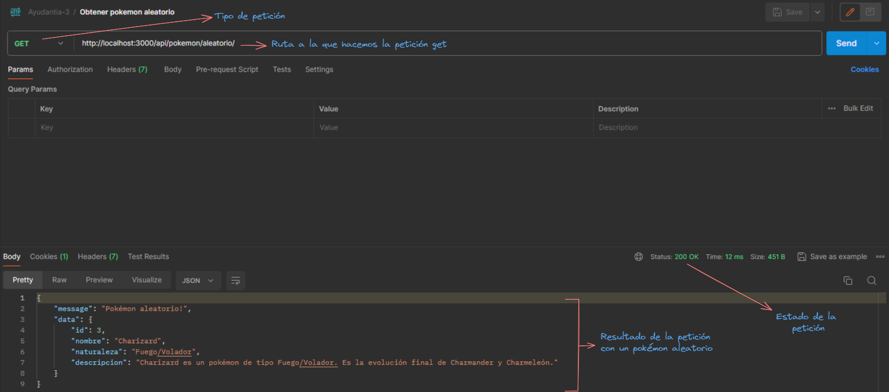
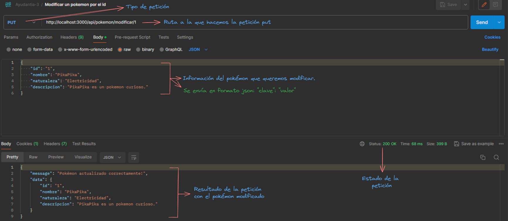
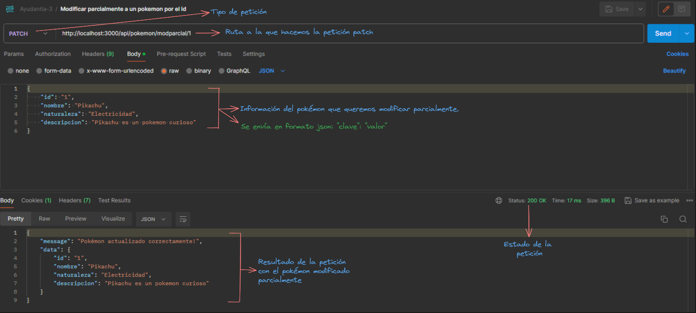
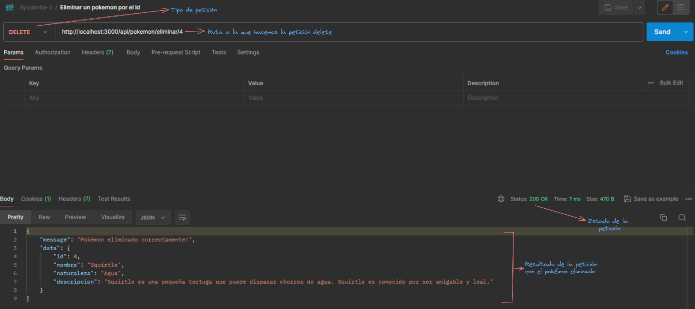

## Peticiones con Postman!

- Petición **post** a la ruta http://localhost:3000/api/pokemon/crear para crear un pokémon:

- Petición **get** a la ruta http://localhost:3000/api/pokemon/obtener/1 para obtener un pokémon por el id:

- Petición **get** a la ruta http://localhost:3000/api/pokemon/todos/ para obtener a todos los pokémones:

- Petición **get** a la ruta http://localhost:3000/api/pokemon/aleatorio/ para obtener a un pokémon aleatorio:

- Petición **put** a la ruta http://localhost:3000/api/pokemon/modificar/1 para modificar a un pokémon por el id:

- Petición **patch** a la ruta http://localhost:3000/api/pokemon/modparcial/1 para modificar parcialmente a un pokémon por el id:

- Petición **delete** a la ruta http://localhost:3000/api/pokemon/eliminar/4 para eliminar a un pokémon por el id:

