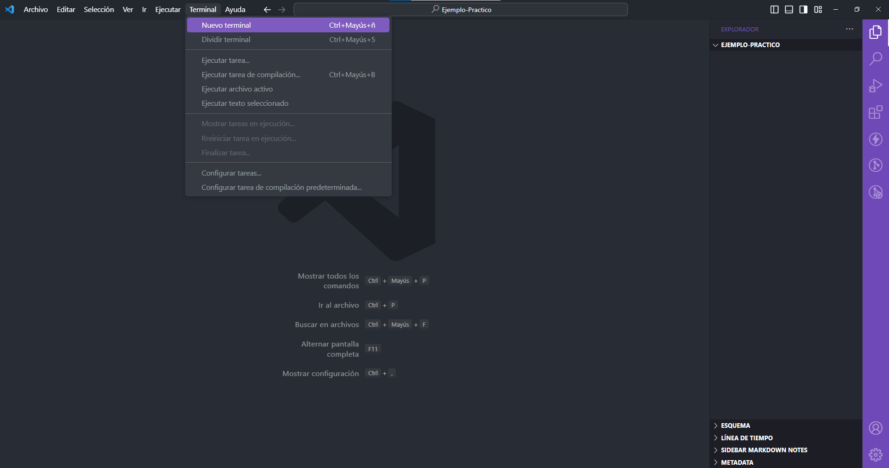
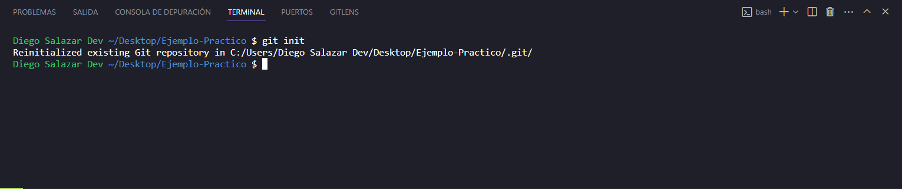
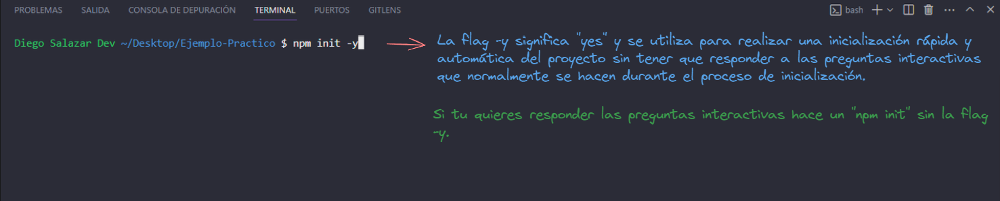
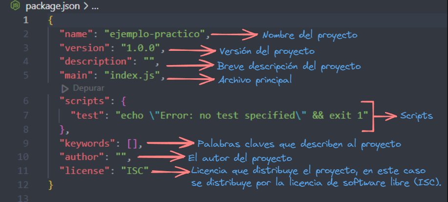
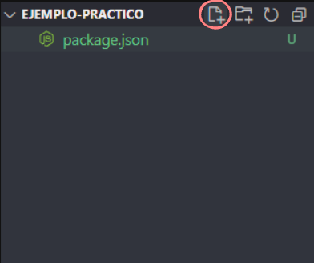
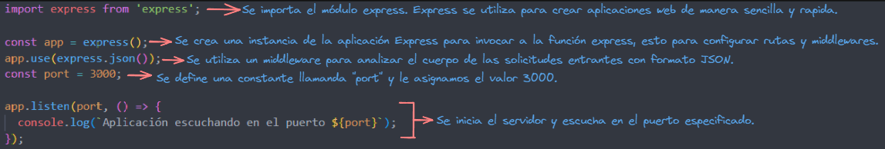
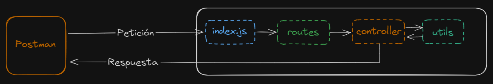
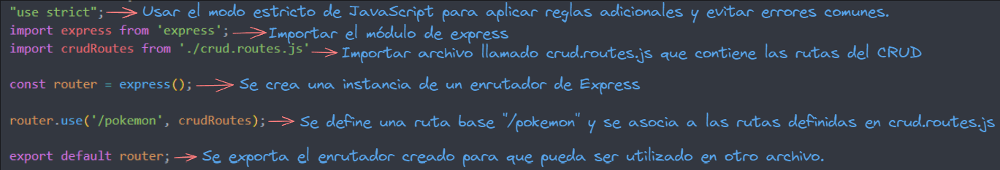
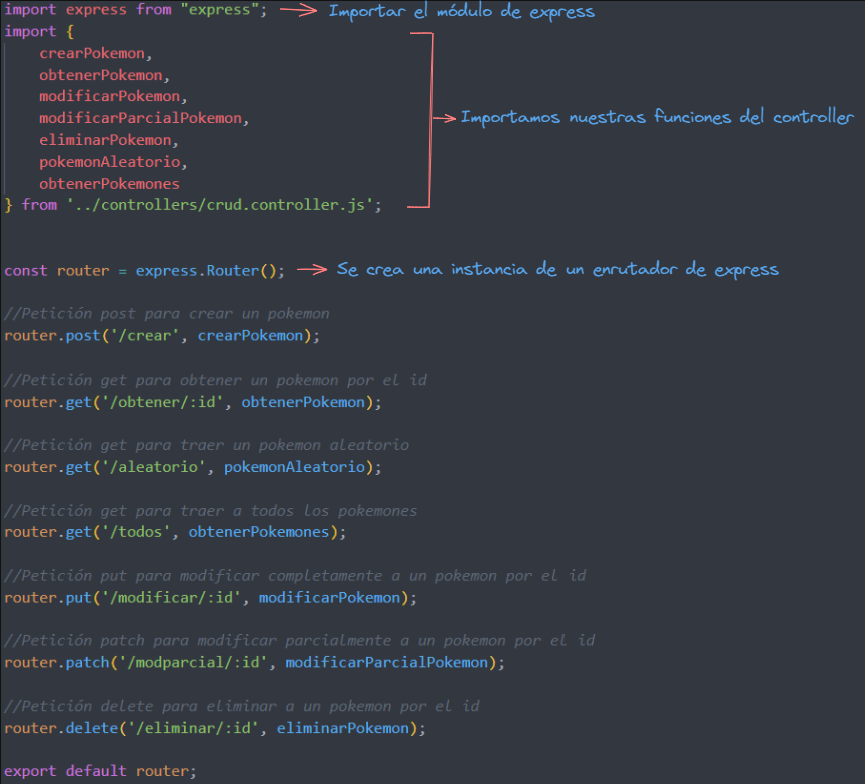

## Crud sin base de datos!

### Pasos a seguir:

- Crear una carpeta en el escritorio
- Abrir la carpeta con **Visual Studio Code**
- Una vez abierta la carpeta en el **Visual Studio Code**, abrir una terminal, como se muestra en el ejemplo:



- Usamos el comando **git init** para inicializar nuestro repositorio de git, como se muestra en el ejemplo:



- Una vez iniciado git, procedemos a iniciar nuestro proyecto con **npm init -y**, como se muestra en la siguiente imagen:



- Cuando se realiza el comando para iniciar nuestro proyecto, nos creará un archivo package.json, este con el motivo de definir y gestionar las dependencias del proyecto.
- En la siguiente imagen se muestra el contenido del package.json:



- Se crea primero el archivo .gitignore para evitar subir el archivo **node_modules** que contiene los módulos de las dependencias que instalaremos mas adelante.



- Una vez creado el archivo con el nombre **.gitignore**, el contenido de nuestro archivo será el siguiente:


- Teniendo eso listo, nos dirigimos a la terminal y instalamos **express** con el comando **npm i express**, como se muestra en la imagen:


- Ahora instalamos **nodemon** con el comando **npm i -D nodemon** (-D es para instalar la dependencia como desarrollador).


- Nuestro package.json quedaría de la siguiente manera:


### Estructuración de carpetas para nuestro proyecto

- Primero crearemos una **carpeta raíz**, que se llamará **src**:


- Dentro de la carpeta **src** crearemos una carpeta llamada **controllers**, otra llamada **utils**, otra llamada **routes** y un archivo llamado **index.js**:


- Ahora iremos a modificar el archivo **package.json**, agregaremos un **script** y el apartado de selección de **tipo de módulo** que usaremos:


- Una vez estructurado nuestro proyecto nos dirigimos al archivo **index.js**:
- Agregamos el siguiente código para poder levantar nuestro servidor con **express**:



- Código de **index.js**:

```js
import express from 'express';

const app = express();
app.use(express.json());
const port = 3000;

app.listen(port, () => {
  console.log(`Aplicación escuchando en el puerto ${port}`);
});
```

- Una vez agregado el código, se utiliza el comando **npm run dev** en la consola:


- Con todo eso tenemos el servidor corriendo en el **puerto 3000**.
- El siguiente paso es realizar rutas, pero antes un breve diagrama para explicar como se utilizarán las diferentes carpetas:



- Nuestro **index.js** recibe la petición realizada por nuestro cliente que es el **Postman**.
- El **index.js** busca la ruta que trae nuestra petición.
- Si se encuentra la ruta en nuestro **routes**, esa ruta va a indicar que existe un **controller**, por ende se dirige a esa carpeta.
- En el **controller** se utiliza **utils** que será donde tendremos información para realizar nuestro **CRUD**.
- Una vez realizada la operación en nuestro **controller**, se dará un estado de respuesta (200, 404, 500, etc.) en el **Postman**.

### Construcción de Rutas

- Nos dirigimos a nuestra carpeta routes y creamos dos archivos, uno llamado **index.routes.js** y otro llamado **crud.routes.js**.
- Una vez creados esos dos archivos, nos vamos al archivo **index.routes.js** y colocamos el siguiente código:



- Código de **index.routes.js**:

```js
"use strict";
import express from 'express';
import crudRoutes from './crud.routes.js'

const router = express();

router.use('/pokemon', crudRoutes);

export default router;
```

- Una vez escrito el código de **index.routes.js**, nos vamos al archivo **crud.routes.js** y escribimos el siguiente código:



- Código de **crud.routes.js**:

```js
import express from "express";
import { 
    crearPokemon, 
    obtenerPokemon, 
    modificarPokemon, 
    modificarParcialPokemon, 
    eliminarPokemon,
    pokemonAleatorio,
    obtenerPokemones
} from '../controllers/crud.controller.js';


const router = express.Router();

//Petición post para crear un pokemon
router.post('/crear', crearPokemon);

//Petición get para obtener un pokemon por el id
router.get('/obtener/:id', obtenerPokemon);

//Petición get para traer un pokemon aleatorio
router.get('/aleatorio', pokemonAleatorio);

//Petición get para traer a todos los pokemones
router.get('/todos', obtenerPokemones);

//Petición put para modificar completamente a un pokemon por el id
router.put('/modificar/:id', modificarPokemon);

//Petición patch para modificar parcialmente a un pokemon por el id
router.patch('/modparcial/:id', modificarParcialPokemon);

//Petición delete para eliminar a un pokemon por el id
router.delete('/eliminar/:id', eliminarPokemon);

export default router;
```

### Modificación del archivo index.js

- Se realiza esta modificación para así utilizar una **buena práctica de programación** dejando antes de todas nuestras rutas el path **"/api"**:


- Código actualizado del **index.js**:

```js
import express from 'express';
import indexRoutes from './routes/index.routes.js';

const app = express();
app.use(express.json());
const port = 3000;

app.use("/api", indexRoutes);

app.listen(port, () => {
  console.log(`Aplicación escuchando en el puerto ${port}`);
});
```

### Construcción de nuestros utils

- Nos dirigimos a nuestra carpeta **utils** y creamos un archivo llamado **pokemones.js**.
- En nuestro archivo llamado **pokemones.js** tendremos los pokémones y sus características, como se muestra en el siguiente código:

```js
export let pokemones = [
    //TODO: Pokemones
    {
        id: 1,
        nombre: "Pikachu",
        naturaleza: "Eléctrico",
        descripcion: "Pikachu es un pokémon eléctrico muy conocido y popular."
    },
    {
        id: 2,
        nombre: "Bulbasaur",
        naturaleza: "Planta/Veneno",
        descripcion: "Bulbasaur es un pokémon que tiene una planta en su espalda que crece a medida que evoluciona"
    },
    {
        id: 3,
        nombre: "Charizard",
        naturaleza: "Fuego/Volador",
        descripcion: "Charizard es un pokémon de tipo Fuego/Volador. Es la evolución final de Charmander y Charmeleón."
    },
    {
        id: 4,
        nombre: "Squirtle",
        naturaleza: "Agua",
        descripcion: "Squirtle es una pequeña tortuga que puede disparar chorros de agua. Squirtle es conocido por ser amigable y leal."
    }
]
```

### Construcción de nuestro controller

- Nos dirigimos a nuestra carpeta **controllers** y creamos un archivo llamado **crud.controller.js**
- En nuestro controller primero importamos los pokémones ya creados en nuestro archivo **pokemones.js** y además importamos **crypto** para hacer la función de pokémones aleatorios.
- Imports:


- Código de los **imports**:

```js
import { pokemones } from "../utils/pokemones.js";
import crypto from 'crypto';
```

- Ahora creamos nuestra primera función para **crear un pokémon**:


- Código de la función **crearPokemon**:

```js
export const crearPokemon = async (req, res) => {
    try {
        const pokemon = req.body;

        if(!pokemon){
            res.status(400).json({
                message:"Pokémon no enviado",
                data: null
            })
        }
        pokemones.push(pokemon);

        res.status(201).json({
            message:"Pokémon creado exitosamente!",
            data: pokemon
        })
    } catch (error) {
        res.status(500).json({ message: error.message });
    }
};
```

- Ahora creamos la función que **obtiene un pokémon por el id**:


- Código de la función **obtenerPokemon**:

```js
export const obtenerPokemon = async (req, res) => {
    try {
        const id = req.params.id;
        const pokemon = pokemones.find((pokemon) => pokemon.id == id)
        if(!pokemon){
            res.status(404).json({
                message: "Pokémon no encontrado",
                data: null
            })
            return;
        }

        res.status(200).json({
            message: "Pokémon encontrado!",
            data: pokemon
        })
    } catch (error) {
        res.status(500).json({ message: error.message });
    }
};
```

- Ahora crearemos la función que **obtiene a todos los pokémones**:


- Código de la función **obtenerPokemones**:

```js
export const obtenerPokemones = async (req, res) => {
    try {
        res.status(200).json({
            message: "Lista de Pokémones",
            data: pokemones
        })
    } catch (error) {
        res.status(500).json({ message: error.message });
    }
};
```

- Ahora crearemos la función que **obtiene un pokémon aleatorio**:


- Código de la función **pokemonAleatorio**:

```js
export const pokemonAleatorio = async (req, res) => {
    try {
        const randomNum = crypto.randomInt(1, 4);
        const pokemon = pokemones.find((pokemon) => pokemon.id == randomNum)
        if(!pokemon){
            res.status(404).json({
                message: "Pokémon no encontrado",
                data: null
            })
            return;
        }
        
        res.status(200).json({
            message: "Pokémon aleatorio!",
            data: pokemon
        })
    } catch (error) {
        res.status(500).json({ message: error.message });
    }
};
```

- Ahora crearemos la función para **modificar a un pokémon**:


- Código de la función **modificarPokemon**:

```js
export const modificarPokemon = async (req, res) => {
    try {
        const id = req.params.id;
        const pokemon = req.body;
        const index = pokemones.findIndex((pokemon) => pokemon.id == id);

        if(index === -1){
            res.status(404).json({
                message:"Pokémon no encontrado",
                data: null
            })
            return;
        }

        pokemones[index] = pokemon
        console.log(pokemones[index])

        res.status(200).json({
            message: "Pokémon actualizado correctamente!",
            data: pokemon 
        })

    } catch (error) {
        res.status(500).json({ message: error.message });
    }
};
```

- Ahora crearemos la función para **modificar parcialmente a un pokémon**:


- Código de la función **modificarParcialPokemon**:

```js
export const modificarParcialPokemon = async (req, res) => {
    try {
        const id = req.params.id;
        const pokemon = req.body;
        const index = pokemones.findIndex((pokemon) => pokemon.id == id);

        if(index === -1){
            res.status(404).json({
                message:"Pokémon no encontrado",
                data: null
            })
            return;
        }

        pokemones[index] = pokemon
        console.log(pokemones[index])

        res.status(200).json({
            message: "Pokémon actualizado correctamente!",
            data: pokemon 
        })

    } catch (error) {
        res.status(500).json({ message: error.message });
    }
};
```

- Ahora crearemos la ultima función para **eliminar a un pokémon**:


- Código de la función **eliminarPokemon**:

```js
export const eliminarPokemon = async (req, res) => {
    try {
        const id = req.params.id;
        const index = pokemones.findIndex((pokemon) => pokemon.id == id);
        if(index === -1){
            res.status(404).json({
                message:"Pokémon no encontrado",
                data: null
            })
            return;
        }

        const pokemonEliminado = pokemones.splice(index,1);

        res.status(200).json({
            message: "Pokémon eliminado correctamente!",
            data: pokemonEliminado
        })

    } catch (error) {
        res.status(500).json({ message: error.message });
    }
};
```