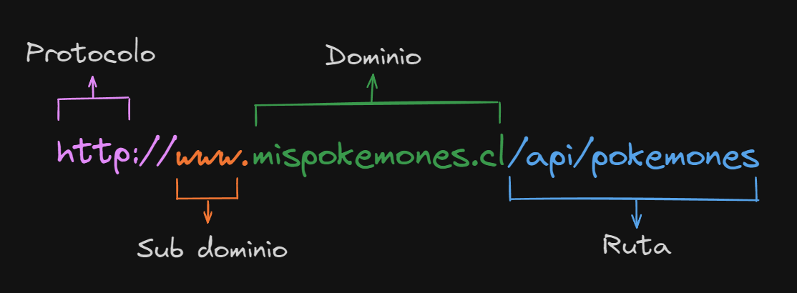

## URL

### ¿Qué es una URL?

- **URL** significa *Uniform Resource Locator (Localizador de Recursos Uniforme)*.
- Una URL no es más que una dirección que es dada a un recurso único en la Web.
- En teoría, cada URL válida apunta a un único recurso. Dichos recursos pueden ser páginas HTML, documentos CSS, imágenes, etc. En la práctica, hay algunas excepciones, siendo la más común una URL apuntando a un recurso que ya no existe o que ha sido movido.
- Como el recurso representado por la URL y la URL en si son manejadas por el servidor Web, depende del dueño del servidor web manejar ese recurso y su URL asociada adecuadamente.

### Anatomía de una URL

Una URL está compuesta de diferentes partes, algunas obligatorios y otras opcionales. Veamos las partes más importantes usando la siguiente URL:

- Protocolo: `http` indica qué protocolo debe usar el navegador. Un protocolo es un método establecido para intercambiar o transferir datos alrededor de una red informática.
- Dominio: `www.mispokemones.cl` es el nombre de dominio. Indica qué servidor web se solicita. Alternativamente, es posible usar directamente una **dirección IP**, pero debido a que es menos conveniente, no se usa con frecuencia en la Web.
- Puerto: :`80` es el puerto. Indica la “puerta” técnica utilizada para acceder a los recursos en el servidor web. Por lo general, se omite si el servidor web utiliza los puertos estándar del protocolo HTTP (80 para HTTP y 443 para HTTPS) para otorgar accesos a sus recursos. De lo contrario es obligatorio.
- Ruta: `/api/pokemones` es la ruta al recurso en el servidor web. En los primeros días de la Web, una ruta como está, representaba la ubicación de un archivo físico en el servidor web. Hoy en día, es principalmente una abstracción manejada por servidores web sin ninguna realidad física.
- Parámetros: `?nombre=Pikachu` son parámetros adicionales proporcionados al servidor web. Esos parámetros son una lista de pares clave/valor. El servidor web puede usar esos parámetros para hacer cosas adicionales antes de devolver el recurso. Cada servidor web tiene sus propias reglas con respecto a los parámetros, y la única forma confiable de saber si un servidor web específico está manejando parámetros es preguntando al propietario del servidor web.