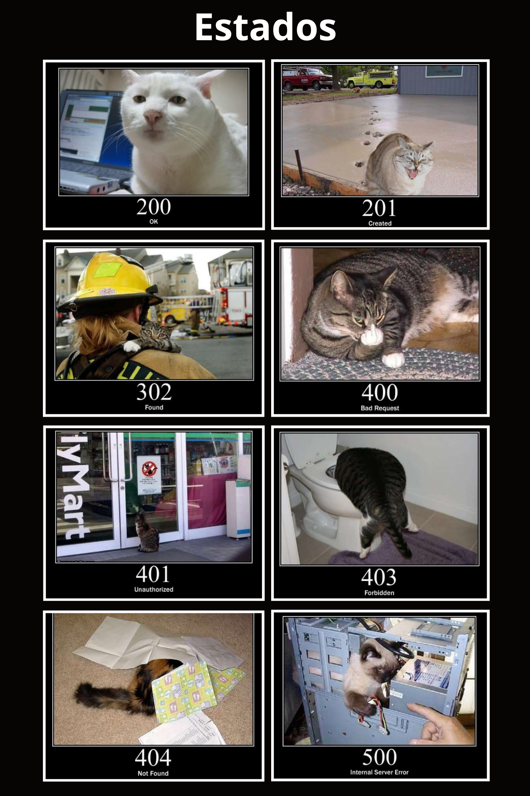

## Estados (status)

#### ¿Cómo ha ido la operación?

A continuación se presentan algunos de los códigos de estado HTTP más comunes y su significado:

- **200 Éxito (OK):** Indica que la solicitud ha sido exitosa y se ha obtenido una respuesta adecuada. Este estado es comúnmente utilizado para respuestas correctas.
- **201 Creado (Created):** Indica que la solicitud ha sido exitosa y se ha creado un nuevo recurso como resultado. Este estado es comúnmente utilizado después de una operación de creación exitosa.
- **302 Redirección (Found):** Indica que la solicitud debe ser redirigida a otra ubicación, generalmente debido a un cambio temporal en la dirección del recurso solicitado.
- **400 Solicitud incorrecta (Bad Request):** Indica que la solicitud enviada por el cliente es inválida o no se puede procesar. Puede ser debido a un error en la sintaxis o en los parámetros de la solicitud.
- **401 No autorizado (Unauthorized):** Indica que se requiere autenticación para acceder al recurso solicitado. El cliente debe proporcionar credenciales válidas para proceder.
- **403 Prohibido (Forbidden):** Indica que el servidor ha entendido la solicitud, pero se niega a cumplirla. El cliente no tiene los permisos necesarios para acceder al recurso solicitado.
- **404 No encontrado (Not Found):** Indica que el recurso solicitado no se ha encontrado en el servidor. Puede ser debido a una URL incorrecta o a que el recurso ha sido eliminado.
- **500 Error del servidor (Internal Server Error):** Indica que ha ocurrido un error interno en el servidor que impide que se complete la solicitud. Este estado es usado generalmente para errores no especificados.

#### Recomendaciones

- Link en donde podrás encontrar los diferentes estados: https://http.cat/

#### Algunas recomendaciones de estados:

