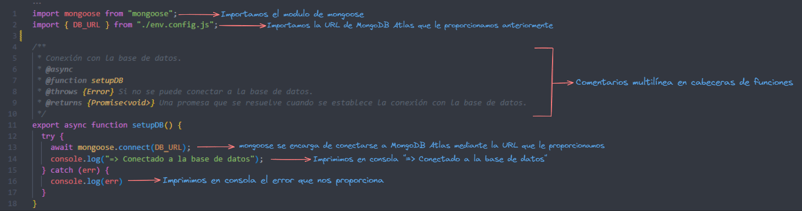
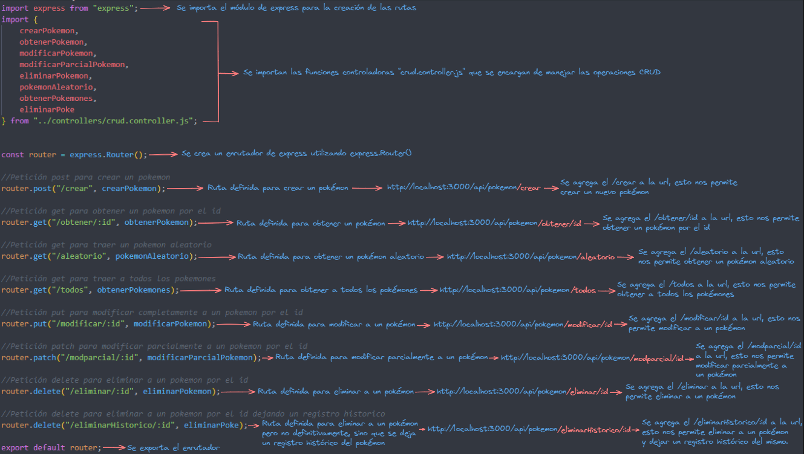
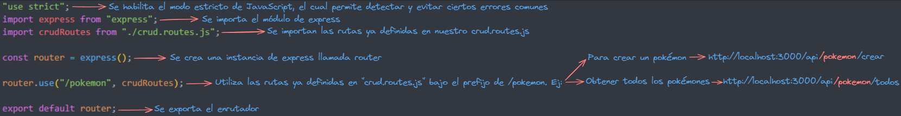
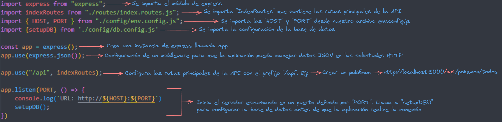
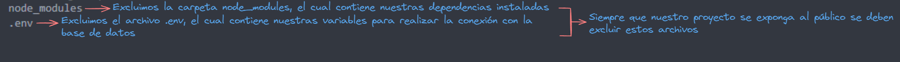

## CRUD con base de datos!

### Carpeta config

- **.env.example:**

```
PORT=Puerto del servidor
HOST=localhost
DB_URL=Link de MongoDB Atlas
```

- **db.config.js:**



- **env.config.js:**


### Carpeta controllers

- **Crear un pokémon:**


- **Obtener un pokémon por el id:**


- **Obtener un pokémon aleatorio:**


- **Obtener todos los pokémones:**


- **Modificar un pokémon:**


- **Eliminar un pokémon:**


- **Eliminar un pokémon con registro historico:**


### Carpeta models

- **pokemones.model.js:**


### Carpeta routes

- **crud.routes.js:**



- **index.routes.js:**



### Archivo index.js

- **index.js:**



### Archivo .gitignore

- **.gitignore:**



### Archivo package.json

- **package.json:**

