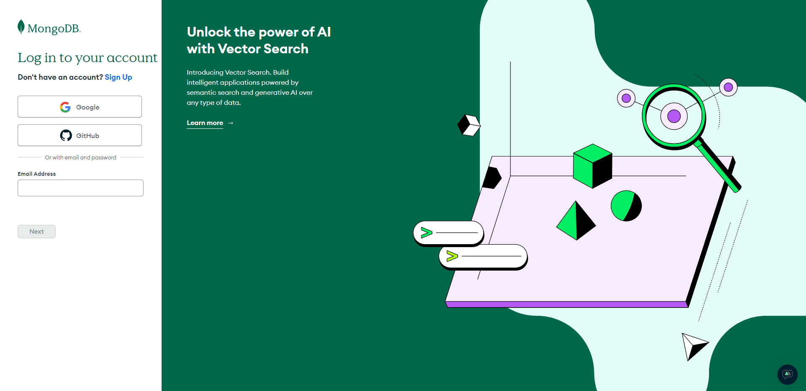
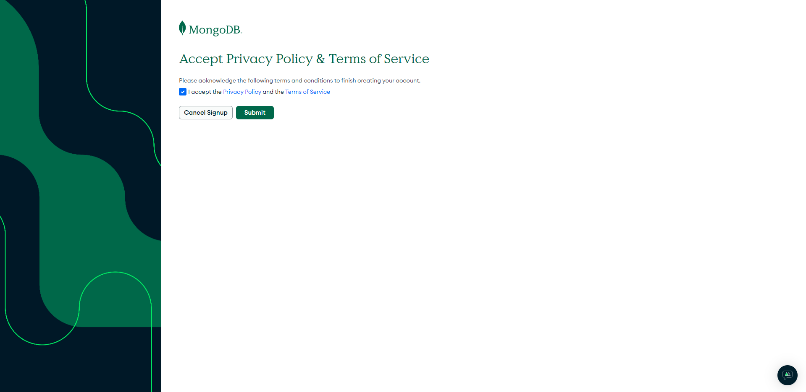
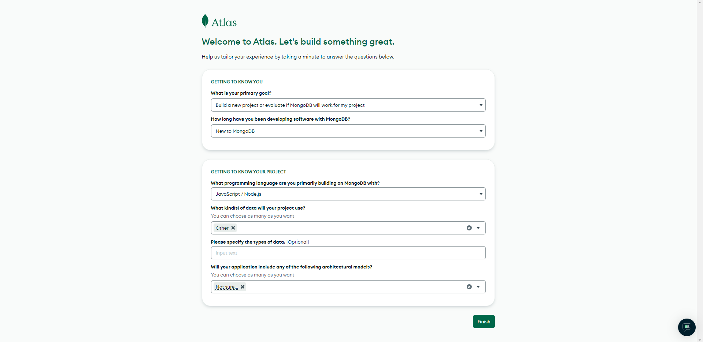
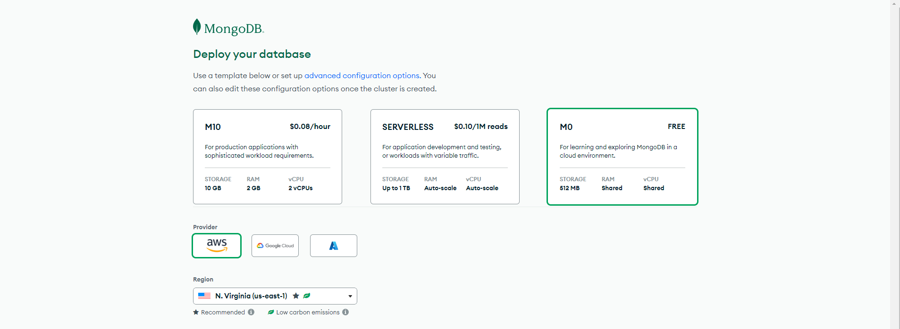
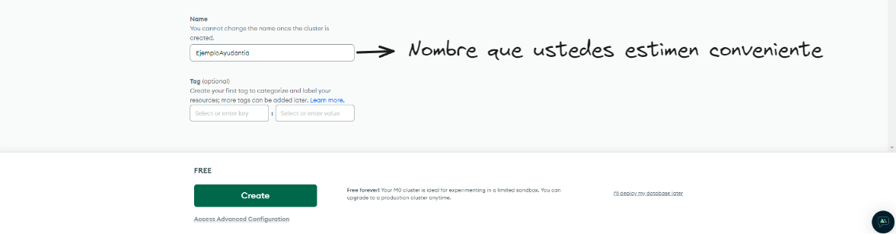
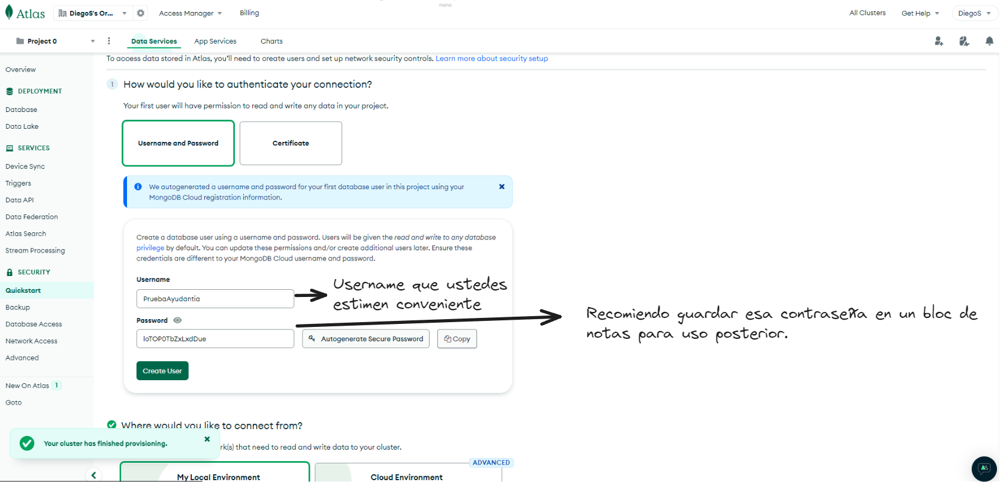
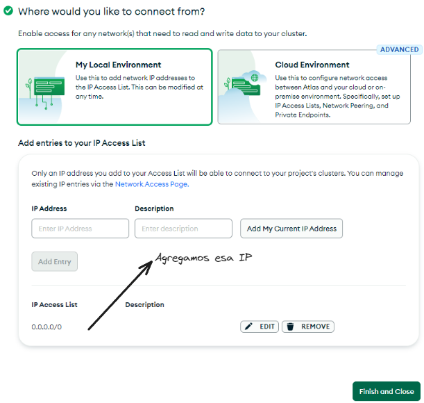
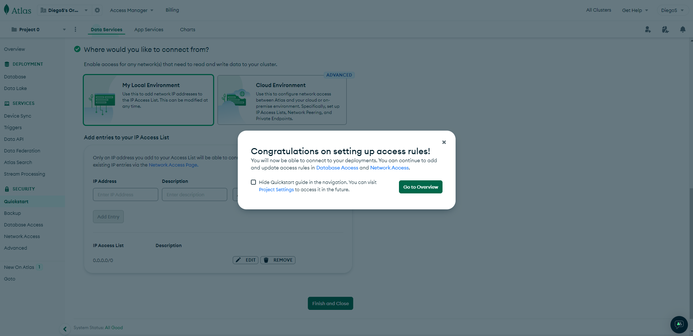
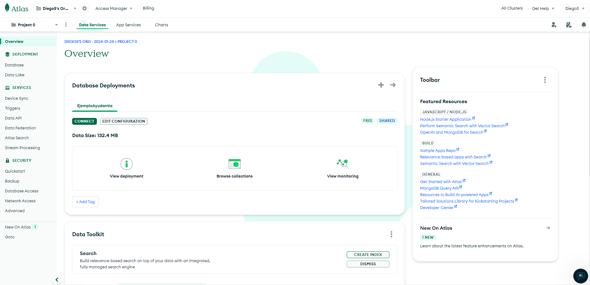
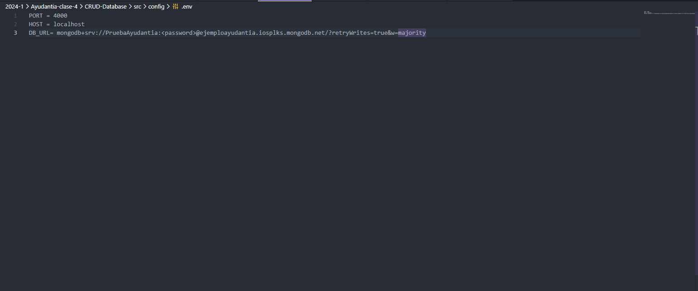

## Conexión a MongoDB Atlas

- Primero se tiene que iniciar sesión en MongoDB Atlas. Recomendable iniciar sesión con una cuenta de Google:
    - Link: [MongoDB Atlas](https://account.mongodb.com/account/login)

- Una vez seleccionada la cuenta de Google con la que iniciaremos la sesión, aceptamos la política de privacidad y las condiciones del servicio:

- Luego nos darán la bienvenida y nos solicitarán algunos campos que rellenar, puede elegir las mismas opciones:

- Ahora nos aparece un apartado en donde nos indica desplegar nuestra base de datos, en donde nosotros seleccionaremos las siguientes opciones:

- Ahora procedemos a configurar el apartado de **Security Quickstart:**

- Le damos a **Finish and Close** y luego a **Go to Overview:**

- Luego estaremos en el apartado de **Overview**, en donde podremos visualizar nuestras **implantaciones de bases de datos** o **Database Deployments** y nos aparecerá nuestra la opción para conectarse a nuestra base de datos ya creada anteriormente:

- Le damos a **Connect** y nos aparecerá la siguiente **interfaz:**

- Hacemos click en la opción que dice Drivers y luego nos mostrará lo siguiente:

- Copiamos lo que dice en el apartado de **Add your connection string into your application code** en nuestro archivo **.env**.
- Agregamos `PORT = 4000`, `HOST = localhost` y lo mas importante `DB_URL = <lo que copiamos en el paso anterior>` :

- Ahora debemos modificar donde dice `<password>` y debemos colocar la contraseña que copiamos en nuestro bloc de notas:

- En caso de no haber copiado con anterioridad la contraseña en un bloc de notas, podemos generar una nueva contraseña, nos vamos al apartado de **Security Quickstart** y seleccionamos la opción **edit**:

- Luego de seleccionar la opción **edit**, podemos **autogenerar una contraseña segura** y esa será la nueva contraseña, luego le dan a **Update Password**.
- Una vez finalizado eso tenemos nuestro archivo **.env** configurado correctamente.