## Conexión a MongoDB en la nube

Si te habías logeado previamente en MongoDB, los pasos son los siguientes:
- Vas al siguiente apartado:

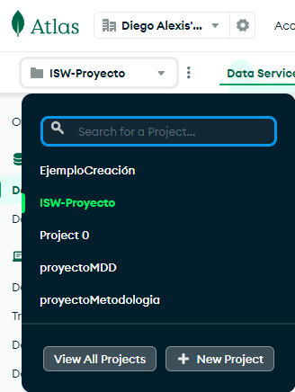

- Creas un nuevo proyecto en `New Project`. Le colocas un nombre al proyecto y `next`:

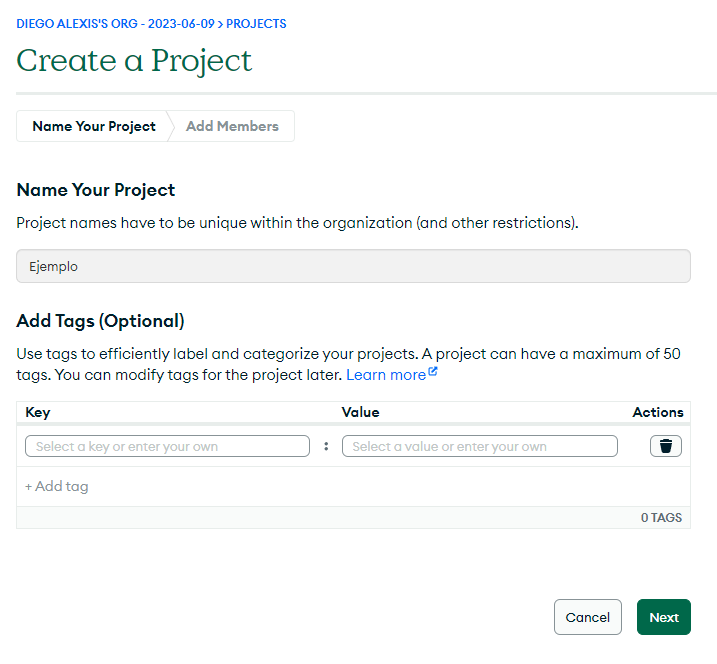

- Agregas a tus miembros de equipo y les asignas el rol de `Project Owner`, así tienen toda la administración del proyecto:

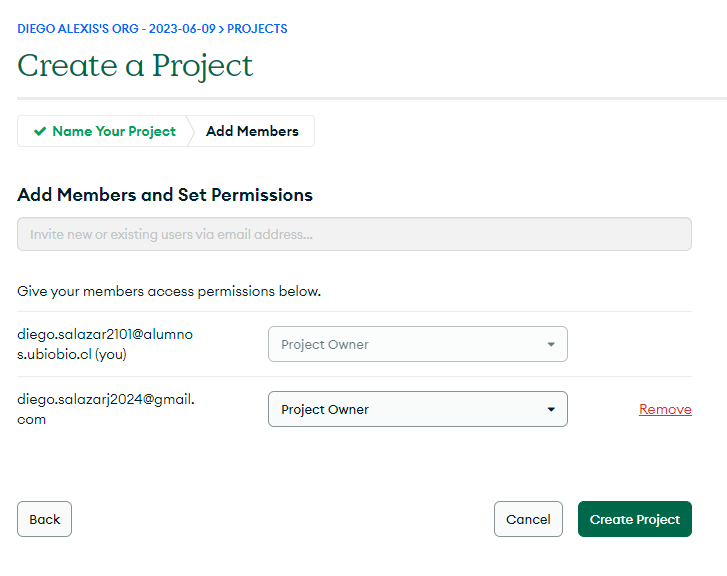

- Le dan a `Create Project` y luego al botón en verde que dice `Create`:

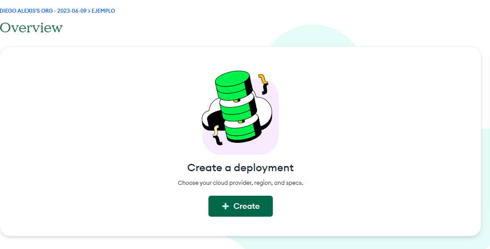

- Seleccionan las siguientes configuraciones y le dan a `Create Deployment`:

- Luego les proporcionara un usuario creado, con su `Username` y `Password` correspondientes, guárdenlos en un bloc de nota y luego le dan a `Create Database User`:

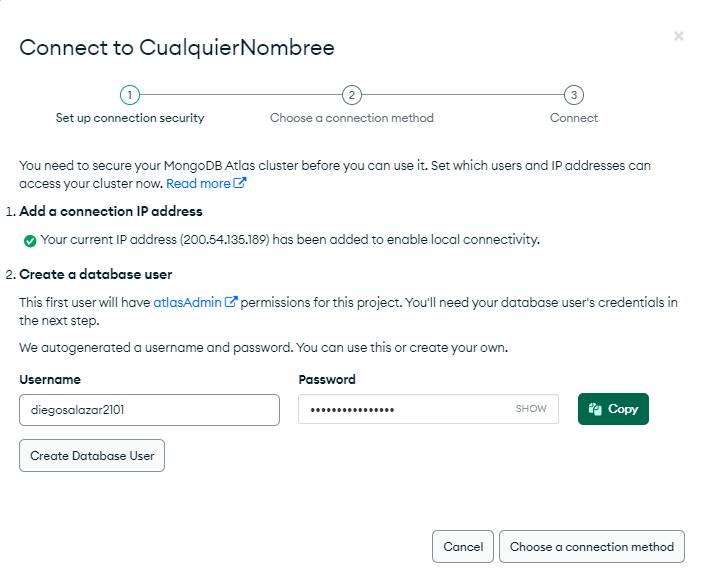

- Le dan a `Choose a connection method` y luego a `Drivers`:

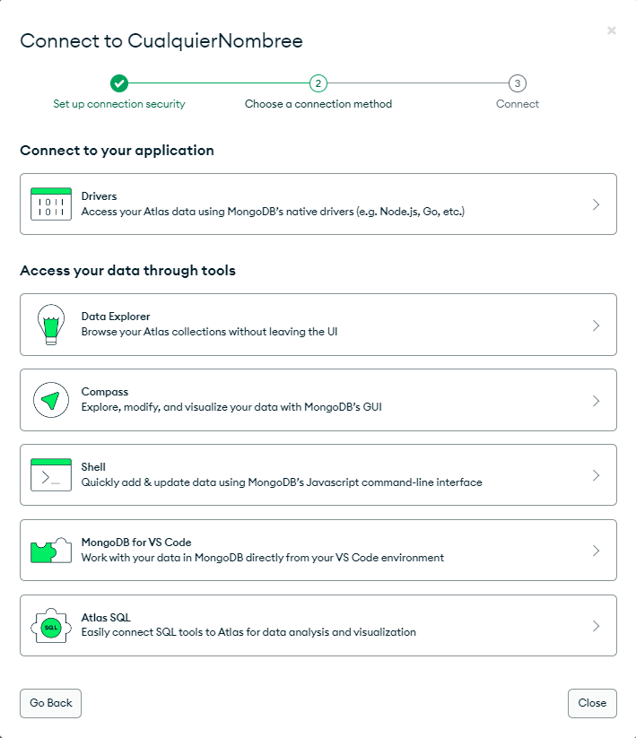

- Al clickear `Drivers` se vería así:

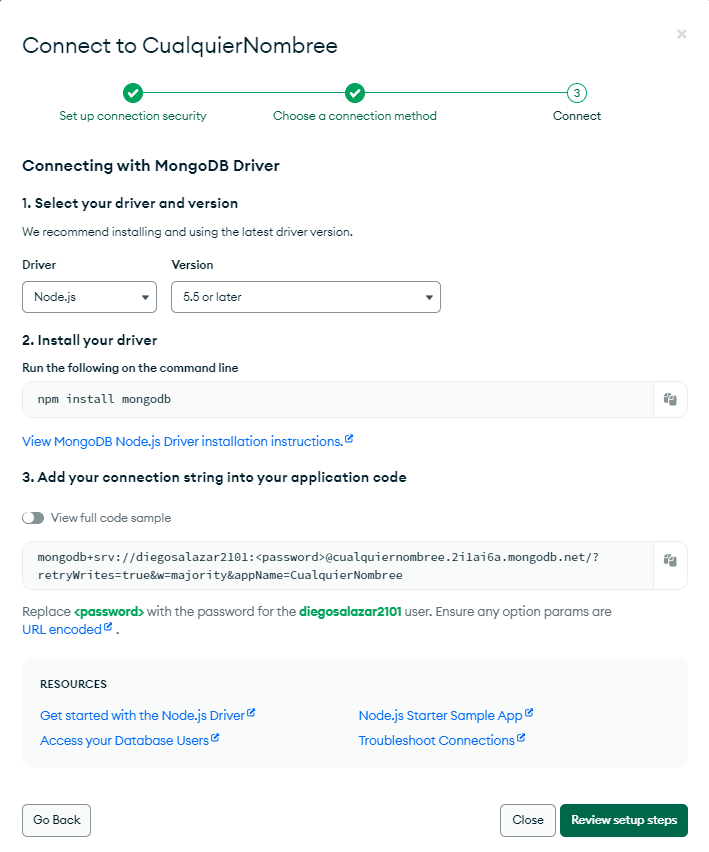

- Copiamos lo que dice en el apartado de `Add your connection string into your application code` en nuestro archivo `.env`.
- Agregamos `PORT=4000`, `HOST=localhost` y lo más importante `DB_URL:<URL del apartado Drivers>`, algo así quedaría utilizando otra URL de ejemplo:

- Ahora debemos modificar donde dice `<password>` y debemos colocar la contraseña que copiamos en nuestro bloc de notas:

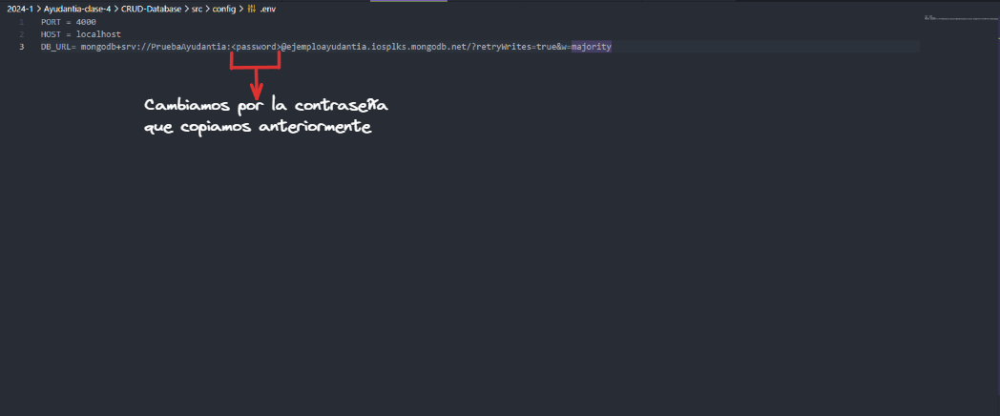

### Apartado importante!

- Ir a -> `Security` -> `Quickstart` y bajan a la zona donde dice `Where would you like to connect from?`:

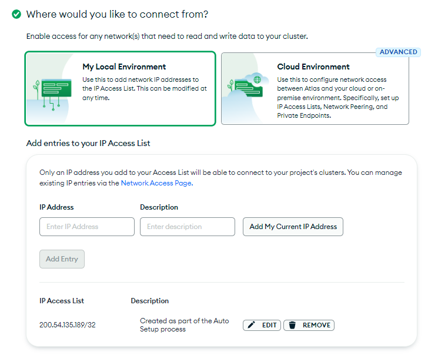

- Eliminan la IP que ya viene por defecto, le dan al botón de `Remove`:

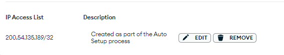

- Escriben la siguiente IP ``0.0.0.0` y la añaden apretando el botón `Add Entry`:

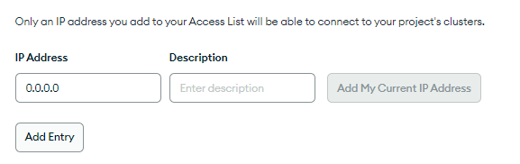

- Una vez agregada la dirección IP, debería quedar de la siguiente manera:

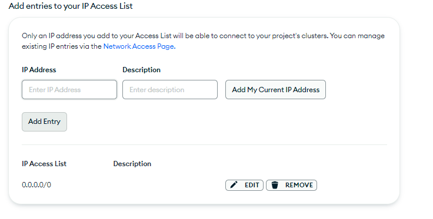

- Le dan al botón de `Finish and Close` y estaría lista nuestra configuración.
