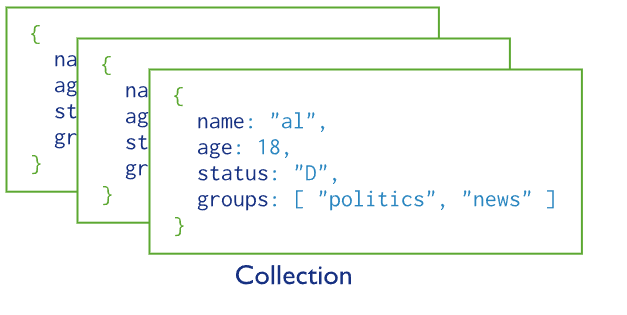
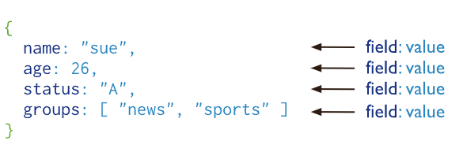
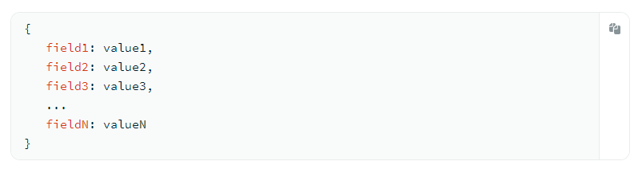
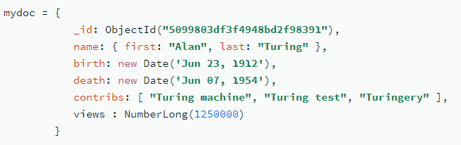
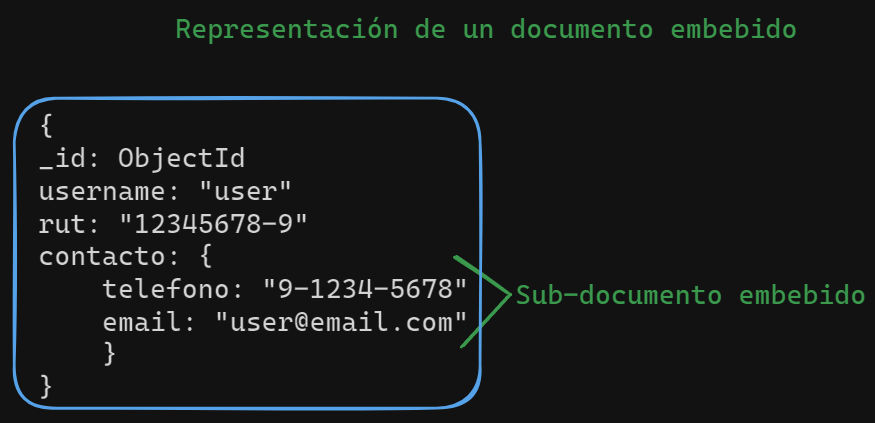
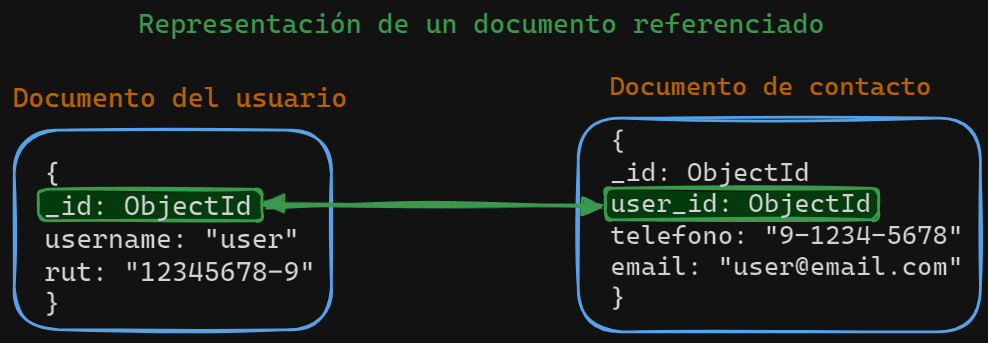
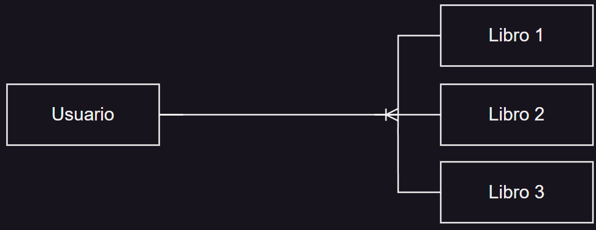
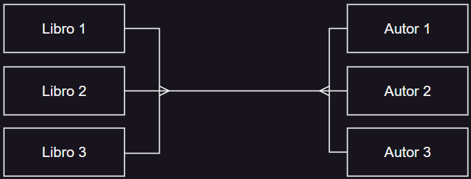
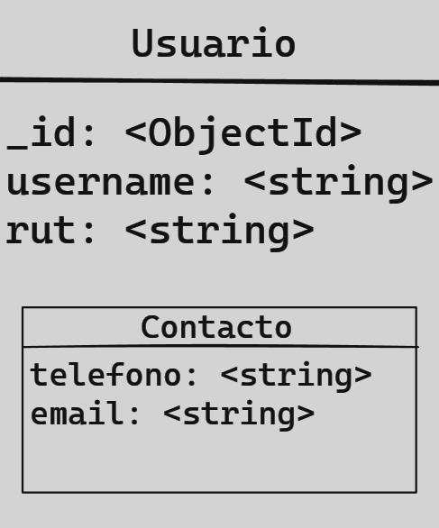
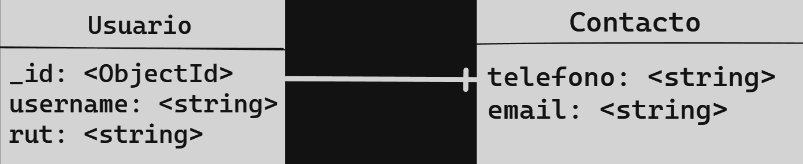

## Conceptos básicos MongoDB

### Colecciones

MongoDB almacena documentos en colecciones. Las colecciones son análogas a las tablas de las base de datos relacionales.

### Documentos

MongoDB almacena los registros de datos como documentos BSON. BSON es una representación binaria de JSON, aunque contiene más tipos de datos que JSON.

### Estructura de los documentos

Los documentos MongoDB se componen de pares campo-valor y tienen la siguiente estructura:

El valor de un campo puede ser cualquiera de los tipos de datos BSON, incluidos otros documentos y matrices de documentos. Por ejemplo, el siguiente documento contiene valores de distintos tipos:

### Documentos embebidos

En MongoDB, un documento embebido se refiere a un tipo de estructura de datos donde un documento (objeto JSON) se encuentra anidado dentro de otro documento. Esto es comúnmente utilizado para modelar relaciones uno a uno o muchos entre entidades.

### Documentos referenciados

En MongoDB, un documento referenciado se refiere a establecer una relación entre dos documentos utilizando referencias a los `ObjectId` de los documentos relacionados. Esto es similar a establecer claves foráneas en una base de datos relacional.

## Modelamiento de datos

### Tipos de relaciones

- Uno a Uno (1-1).
- Ejemplo: Un libro tiene un ISBN.
- `ISBN`: International Standard Book Number, que es un código numérico utilizado para identificar de manera única a cada libro.

- Uno a Muchos (1-N) o Muchos a Uno (N-1).
- Ejemplo: Un usuario posee muchos libros.

- Muchos a Muchos (N-N).
- Ejemplo: Uno o más libros pueden ser escritos por uno o más autores.

### Documento embebido

Usar sub-documentos para realizar las relaciones, que esta un documento dentro de otro.

- Mejora rendimiento en búsqueda de muchos datos relacionados.
- Limitado a 1-1 y 1-N en una dirección.
- Ejemplo de un documento embebido:

- Representación como entidad en MR:

### Documento referenciado

Los documentos están separados y se hacen referencia entre ellos con identificadores. En UML, se expresan con cajitas separadas y una cardinalidad.

- Reduce el tamaño de la base de datos.
- Datos no repetidos.
- Actualización de datos únicos para muchos.
- Permite 1-1, 1-N, N-1, N-N.
- Ejemplo de un documento referenciado:

Representación como entidad en MR:

### Preguntas para decidir a utilizar

1. ¿Qué tan frecuente es **consultada** esa información?
2. ¿Qué tan frecuente se **actualiza** esa información?
3. ¿La información se consulta en **conjunto** o por pates?