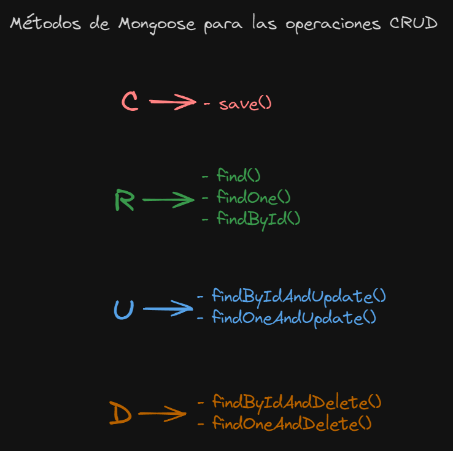

> [!IMPORTANT]
> Recuerda que puedes visitar la documentación oficial de [Mongoose!](https://mongoosejs.com/docs/index.html)

## Mongoose

### ¿Cómo definir un schema?

Imaginemos que en nuestro backend debemos realizar un formulario en donde se ingresen diferentes datos de una persona, como por ejemplo:

- `Nombre Completo`
- `Rut`
- `Correo electronico`
- `Dirección`

Ya sabemos que características debe tener nuestro modelo!, En el siguiente ejemplo se define el [esquema de nuestra colección de MongoDB](https://mongoosejs.com/docs/guide.html).

### Archivo formPersona.model.js

```javascript
import mongoose from 'mongoose';
const { Schema } = mongoose;

const formPersona = new Schema({
  nombreCompleto: {
		  type: String,
		  required: true,
	},
  rut: {
		  type: String,
		  required: true,
		  unique: true,
	},
  email: {
		  type: String,
		  required: true,
		  unique: true,
	},
  direccion: {
		  type: String,
		  required: true,
	}
});
```

### Funciones de Mongoose para operaciones CRUD recomendadas!

- `Model.find()` : Encuentra todos los documentos que coinciden con los criterios de consulta especificados.
- `Model.findById()` : Encuentra un documento por su ID.
- `Model.findByIdAndDelete()` : Encuentra un documentos por su ID y lo elimina.
- `Model.findByIdAndUpdate()` : Encuentra un documento por su ID y lo actualiza.
- `Model.findOne()` : Encuentra un solo documento que coincide con los criterios de consulta especificados.
- `Model.deleteOne()` : Elimina un solo documento que coincide con los criterios de consulta especificados.
- `Model.findOneAndDelete()` : Encuentra un documento que coincide con los criterios de consulta especificados y lo elimina.
- `Model.finOneAndUpdate()` : Encuentra un documento que coincide con los criterios de consulta especificados y lo actualiza.
- `.save()` : Se utiliza para guardar un documento en la base de datos.  Si el documento aún no existe en la base de datos, lo insertará como un nuevo documento; si ya existe en la base de datos, actualizará el documento con los cambios realizados en la instancia del modelo.

### Resumen métodos Mongoose



### Ejemplo de código con método de Mongoose!

```javascript
//IMPORTANT: Obtener un pokémon por el id
export const obtenerPokemon = async (req, res) => {
    try {
        const id = req.params.id;
        const pokemon = await Pokemon.findById(id)
        if(!pokemon){
            res.status(404).json({
                message: "Pokémon no encontrado",
                data: null
            })
            return;
        }

        res.status(200).json({
            message: "Pokémon encontrado!",
            data: pokemon
        })
    } catch (error) {
        res.status(500).json({ message: error.message });
    }
};
```