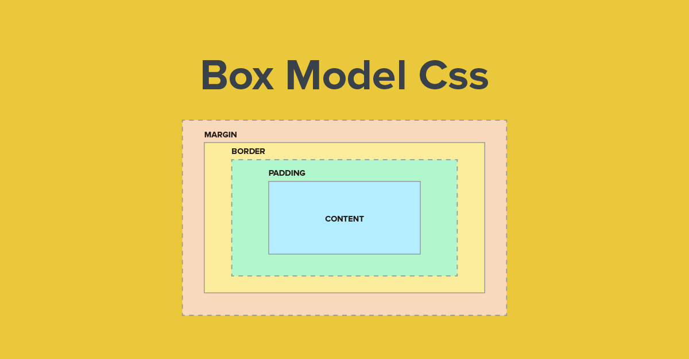

## Modelo de caja

El modelo de caja es uno de los conceptos más importantes en CSS, ya que es fundamental para el diseño y la disposición de las páginas web.

Este modelo representa a cada elemento HTML como una caja rectangular. Estas cajas pueden tener un contenido, un relleno (padding), bordes y márgenes.

- **Contenido:** Es la información que el elemento contiene, que puede ser texto, una imagen, un video, entre otros.
- **Relleno (Padding):** Es el espacio que se encuentra entre el contenido del elemento y su borde. Este espacio está bajo el control del CSS y puede ser ajustado para dar más o menos espacio alrededor del contenido.
- **Borde (Border):** Este es el contorno que encierra al contenido y su relleno. Al igual que el relleno, el borde puede ser ajustado con CSS, pudiendo cambiar su grosor, estilo y color.
- **Margen (Margin):** Es el espacio entre el borde de un elemento y los elementos adyacentes. El margen no es parte del elemento en sí, pero afecta su posición y la de los elementos circundantes.

Manipular estos aspectos de la caja permite a los diseñadores y desarrolladores controlar exactamente cómo se ve y se comporta cada elemento en la página web. Pueden ajustar el tamaño, el espaciado, los colores, etc., proporcionando una gran flexibilidad en la creación de diseños web.

## Representación modelo de caja

