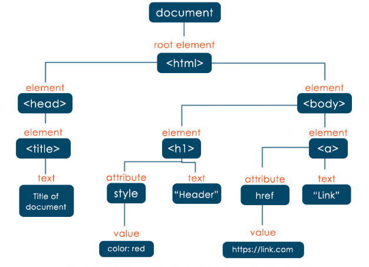

## DOM

### ¿Qué es el DOM?

El DOM (Document Object Model) es una interfaz de programación para documentos HTML y XML. Es una representación estructurada del contenido del documento y permite modificar su contenido y apariencia a través de código JavaScript.

### Estructura del DOM

La estructura del DOM (Document Object Model) se asemeja a un árbol de nodos. Este árbol de nodos es una representación visual de la estructura lógica del documento HTML o XML, y se puede manipular a través de código JavaScript.

Estos nodos representan partes del documento, como elementos HTML, atributos, texto y más. Existen varios tipos de nodos, pero los más comunes son los nodos "Element", "Text" y "Attribute".

El nodo superior, también conocido como la raíz del árbol, se llama el nodo "Document". Este nodo representa al documento completo y es el punto de partida para cualquier interacción con el DOM.

A partir del nodo "Document", el árbol se ramifica en nodos "Element". Los nodos "Element" representan los elementos HTML del documento, como los encabezados, párrafos, enlaces, listas, imágenes, etc.

Cada nodo "Element" puede contener otros nodos "Element", "Text" y "Attribute". Los nodos "Text" representan el texto dentro de un elemento HTML, y los nodos "Attribute" representan los atributos de un elemento HTML, como el id, la clase, el estilo, etc.

Por lo tanto, la estructura del DOM es una representación jerárquica y anidada del documento, que permite a los desarrolladores interactuar y manipular el contenido y la apariencia del documento de manera programática.



### Ejemplo de código con DOM en JavaScript

```js
// Obtener un elemento por su ID
let elemento = document.getElementById("miElemento");

// Cambiar el contenido del elemento
elemento.innerHTML = "Nuevo contenido";

// Cambiar el estilo del elemento
elemento.style.color = "blue";

// Añadir un atributo al elemento
elemento.setAttribute("class", "miClase");

// Añadir un evento al elemento
elemento.addEventListener("click", function() {
    alert("Has hecho clic en el elemento");
});
```

Este es un ejemplo básico de cómo interactuar con el DOM usando JavaScript. Seleccionamos un elemento por su ID, cambiamos su contenido y su color, añadimos un atributo y añadimos un evento de clic.