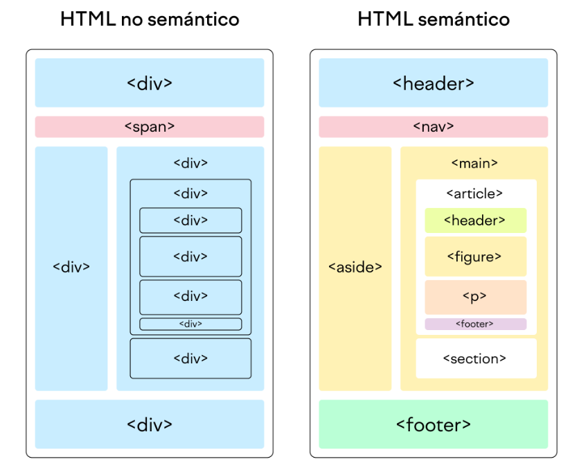

## ¿En que se basa el HTML no semántico?

El HTML no semántico se basa en el uso de etiquetas de HTML basadas en su funcionalidad visual y no en su significado. Por ejemplo, etiquetas como div y span son comunes en HTML no semántico. Estas etiquetas no proporcionan información adicional sobre el contenido que contienen, lo que puede hacer más difícil para los motores de búsqueda y las tecnologías de asistencia interpretar la estructura y el significado de una página web.

## ¿En que se basa el HTML semántico?

El HTML semántico se basa en el uso de etiquetas HTML que describen su significado tanto para el navegador como para el desarrollador. Estas etiquetas proporcionan información sobre el tipo de contenido que contienen, lo que ayuda a los motores de búsqueda y las tecnologías de asistencia a interpretar la estructura y el significado de una página web. Ejemplos de estas etiquetas incluyen `<header>`, `<footer>`, `<article>` y `<section>`.

## HTML semántico v/s HTML no semántico

