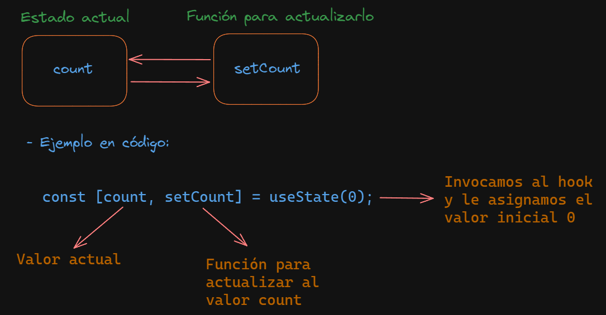

## Uso de useState

### ¿Qué es el hook useState en React?

El hook useState en React es una función que permite a los componentes funcionales gestionar el estado. Se llama dentro de un componente y devuelve un par de valores: el estado actual y una función para actualizarlo. Por ejemplo:

```jsx
const [count, setCount] = useState(0);
```
Aquí, count es el estado inicial (0) y setCount es la función que se usa para actualizarlo. Cada vez que setCount se llama, el componente se vuelve a renderizar con el nuevo estado.

