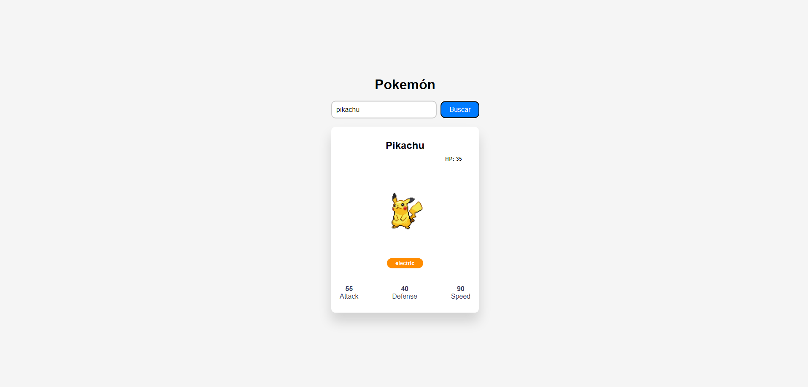

## Consumir API de pokemones

En esta ayudantía, aprendimos a consumir una API de pokemones. Para ello, utilizaremos la API de [PokéAPI](https://pokeapi.co/). Esta API posee una documentación muy bien detallada para que aprendas a consumirla. Además, tiene mucha información de los Pokémones como sus movimientos, habilidades, tipos, poderes, habitad y más. Con esta API puedes crear fácilmente un pokedex. Utilizamos dos alertas para mostrar el error en caso de que el pokemón no exista y otro en caso de que lo encuentre, las alertas son de [SweetAlert2](https://sweetalert2.github.io/).

El endpoint que consumiremos es el siguiente:

```bash
https://pokeapi.co/api/v2/pokemon/${nombre_pokemon}
```

### Componente a utilizar

Creamos un componente reutilizable:

- Utilizamos el componente reutilizable para buscar algo, se llama `Search.jsx`. Este componente lo podemos utilizar en distintos componentes importándolo y pasándole las props necesarias.

```jsx
import { useState } from "react";
import '../styles/search.css';

function Search({ onSearch }) {
    const [query, setQuery] = useState('');

    const handleSearch = () => {
        if (query.trim() !== '') {
            onSearch(query)
        }
    }

    return (
        <div className="search-container">
            <input 
            type="text"
            value={query}
            onChange={(e) => setQuery(e.target.value)}
            placeholder="Nombre o número pokemón"
            className="search-input"
            />
            <button onClick={handleSearch} className="search-button">Buscar</button>
        </div>
    )
}

export default Search;
```

Al llamarlo lo deben hacer muy parecido al colocar una etiqueta, pero la diferencia es que la primera letra para los componentes es en mayúscula.

```jsx
<Search onSearch={pokeFetch} />
```

### Resultado de lo desarrollado

