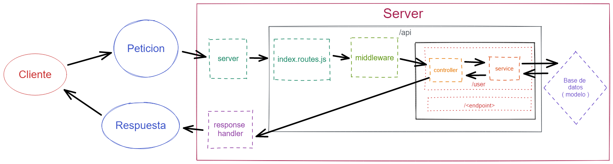

## Arquitectura de nuestra aplicación

- En esta sección vamos a ver como organizar nuestra aplicación para que sea escalable y mantenible.
- Estructura de carpeta recomendada:
  - `/nombreProyecto`
    - `/src`
      - `/api`
        - `/controllers`
        - `/middlewares`
        - `/routes`
          - `router.js`
      - `/services`
        - `/db`
            - `/models`
      - `/utils`
        - `responseHandler.js`
      - `/config`
        - `/env`
          - `.env`
          - `config.js`
      - `index.js`
    - `.gitignore`
    - `package.json`
    - `README.md`

 

## Arquitectura de la aplicación:

- [Volver al BackEnd](./Backend.md)
- [Volver al inicio](../../README.md)