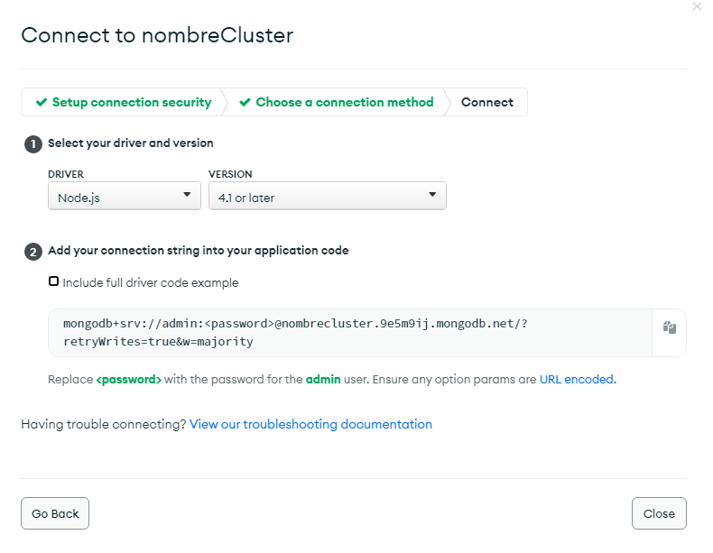

## MongoDB en la nube

- En esta sección vamos a ver como crear una base de datos en la nube con MongoDB Atlas.
- Para esto vamos a usar el servicio de MongoDB Atlas.
- Para crear una cuenta en MongoDB Atlas debemos ir a la siguiente página: [MongoDB Atlas](https://www.mongodb.com/cloud/atlas)
- Una vez que hayamos creado nuestra cuenta vamos a crear un nuevo proyecto.

- Vamos a Network Access y añadimos una ip de acceso. Para este proyecto permitiremos el acceso desde cualquier ip.

- Ahora vamos a crear un usuario para nuestra base de datos. Para esto vamos a Database y creamos la base de datos con el tier gratis

- Seleccionamos el provider, la region y le damos un nombre a la base de datos. Cuando estemos listos le damos a Create Cluster.

- Proceden a configurar el "Security Quickstart"

- Una vez que hayamos creado el usuario vamos a conectar nuestra aplicación a la base de datos.

- Hacemos click en Connect y seleccionamos Connect your application.

- ## _**Y copian esa url que se va a las variables de entorno.**_
- Remplazan la palabra admin por el nombre de usuario que crearon en la base de datos.
- Y remplazan la palabra password por la contraseña que crearon en la base de datos.

- Y por último reiniciamos el servidor en caso de que estuviera corriendo. **Y listo ya tenemos nuestra base de datos en la nube.**

- [Volver al BackEnd](./Backend.md)
- [Volver al inicio](../../README.md)